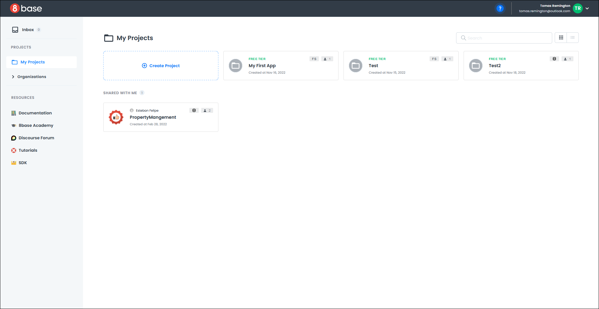
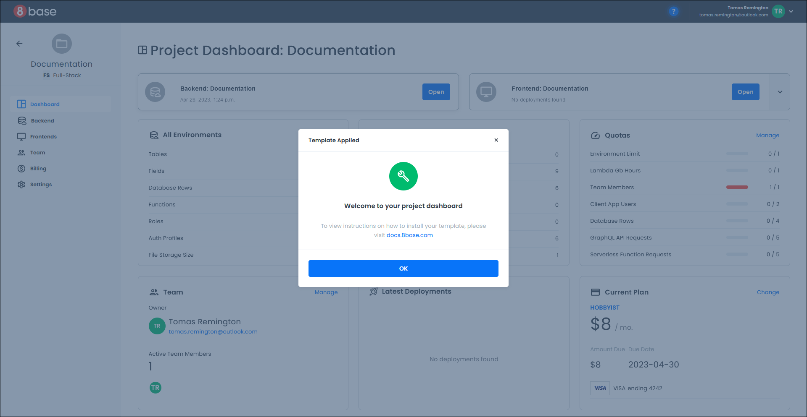
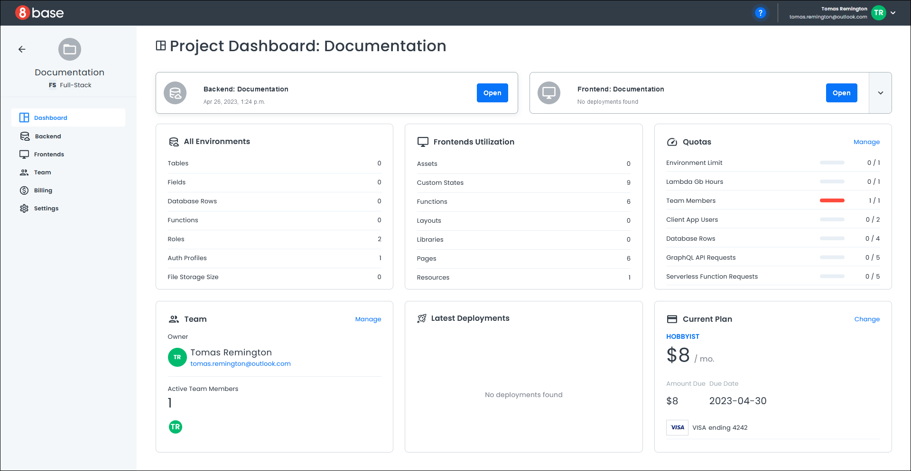

# Provisioning Projects
Provisioning projects in 8base can be done in a few simple steps and allows you to set up Full-Stack or Backend-Only projects in seconds.
_______

## Creating a Project
After you login, the *My Projects* page loads and displays a list of all your projects. This page will be blank if you have not yet created any projects. 

:::note
Before creating your first project, you should set up your payment details. You will be prompted during the project creation process if you still need to do this.
:::

To create a new project:
+ Click "Create Project" in the upper left corner of the My Projects page.
+ A new pop-up opens for you to enter your project details.
+ Enter a unique name for your project.
+ Choose your AWS region, either East or West.
+ Check the "Add Integrated Authentication" box if your project requires authentication.
+ Choose your project type:
    + Full-Stack - frontend and backend workspaces will be created.
    + Backend-Only - only a backend workspace will be created.
+ Choose your payment plan.
+ Click the "Create" button.

The project creator pop-up opens and steps through setting up your project. 

Once your project is created the pop-up closes and you are redirected to your project dashboard.

If your project uses authentication, a new pop-up opens indicating that you must install a *Template* to set up your authentication. (A separate article covers Template installation.)

Click "OK" to close the pop-up. You can now begin working on your new project.

Check out the article **Project UI Walkthrough** to get familiar with the *Project Dashboard*.

