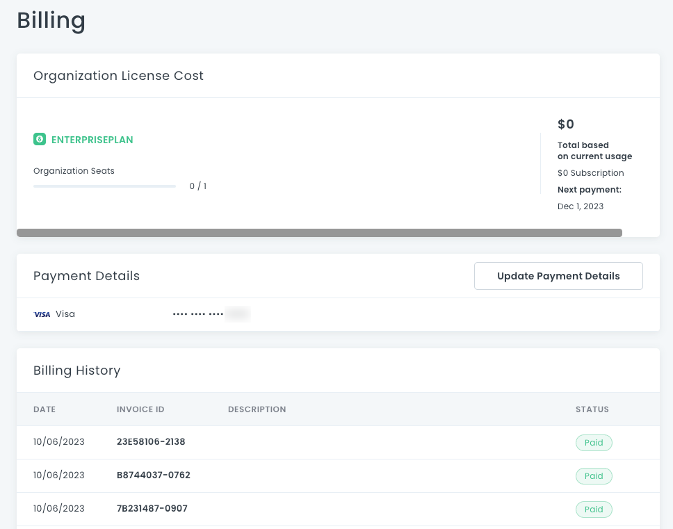

# Organization Billing

On the **Billing** page, the Owner can see the organization license cost, payment details, and billing history. 

## Organization License Cost

This area shows your plan and how many organization seats are in use. You can also see your next payment date and an estimate of how much you will owe on your next bill, based on your current month-to-date usage.

For more information about billing plans, kindly contact our support team.

## Payment Details

This area shows your current payment method. 

### Updating your Payment Method

1. Click the **Update Payment Details** button. A dialog box opens. 
2. Fill in the form and click **Save Changes**. For security purposes, the form will always be blank, and will not contain your previous payment information.

## Billing History

This section shows a table with your past billing date, invoice ID, description, and status.
