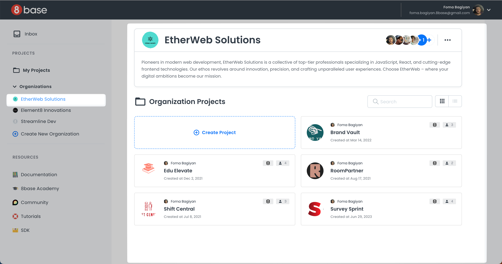
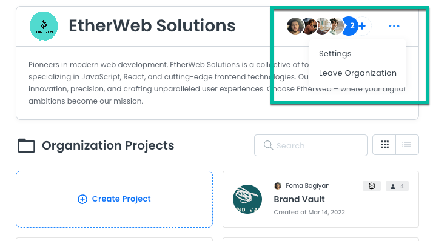
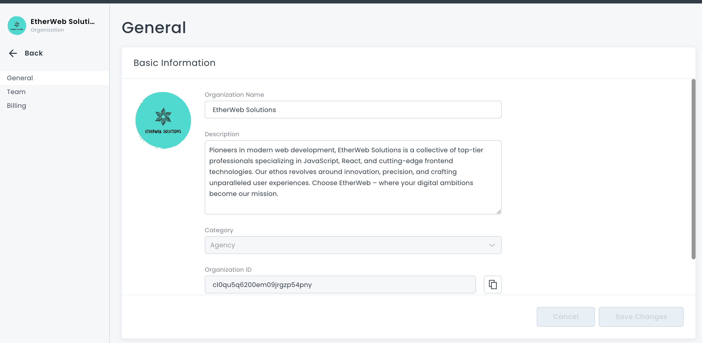
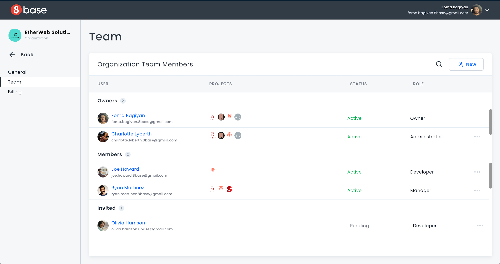
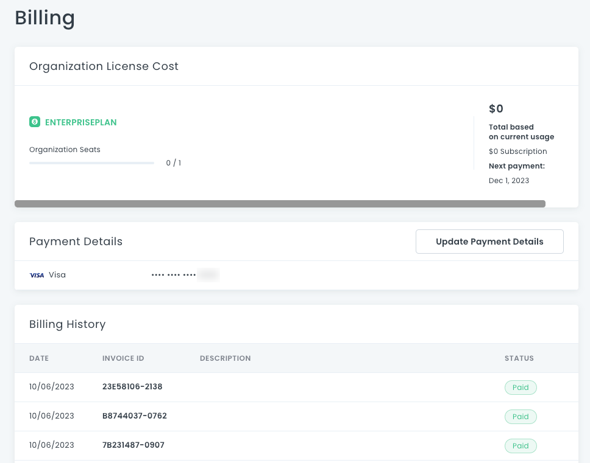

# Organizations Overview

The list of your organizations is displayed on the left sidebar of the 8base Home. Clicking an organization brings you to the **Organization Home**. Here, you will find a description, a list of available projects, and access to settings and team management tools.

## Organization Settings

In the Organization Home, click the **…** menu on the left to open your **Settings**. You can also choose to **Leave Organization**.

There are three main sections: **General**, **Team**, and **Billing**.

### General

**General** displays the organization name, description, category, and Organization ID. Your Organization ID is used for support queries. 

Administrators and the Owner can edit the organization name, description, and icon. When you change the name or description, remember to click **Save Changes**.

Click the organization icon on the left to change the icon. If you have never added an icon, a blank folder will display.

### Team

The **Team** section acts as a control center for managing members, their access levels, and respective project/environment assignments. For more information, see [Organization Team Management](organizations-team-management.md).

### Billing

The **Billing** section offers a comprehensive view of your organization's billing plan, usage, payment details, and billing history. For more information, see [Organization Billing](organizations-billing.md).

