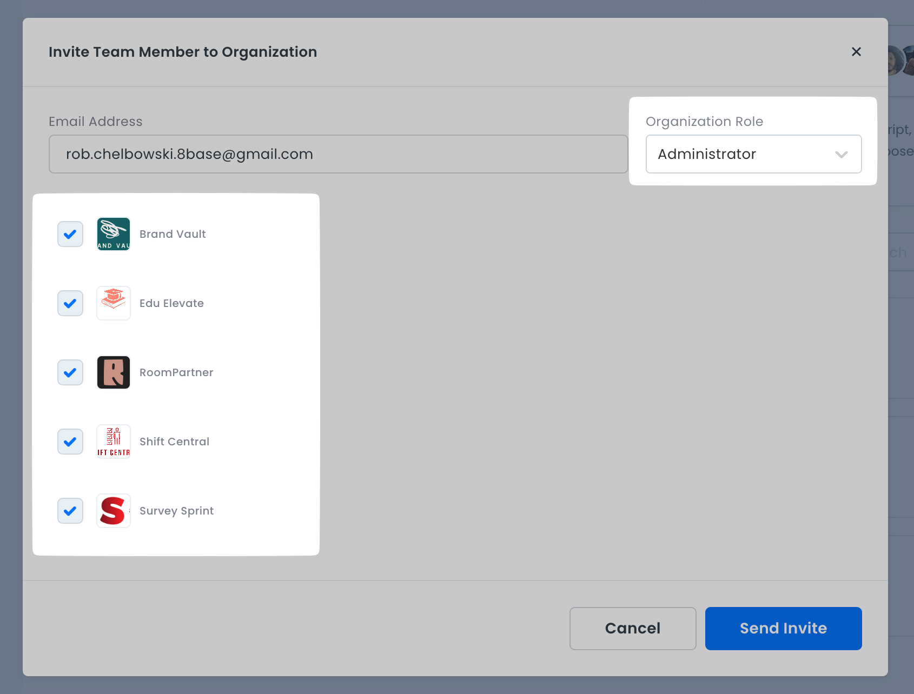
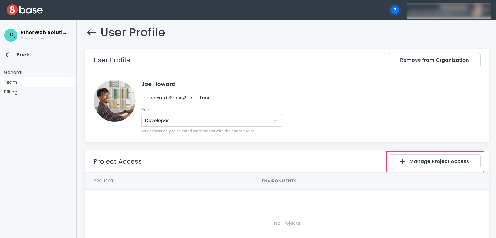
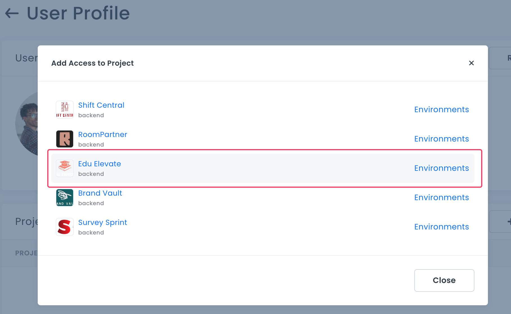
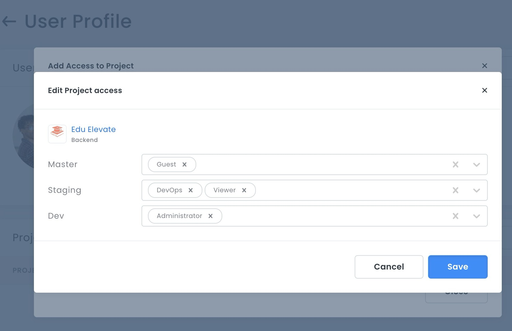
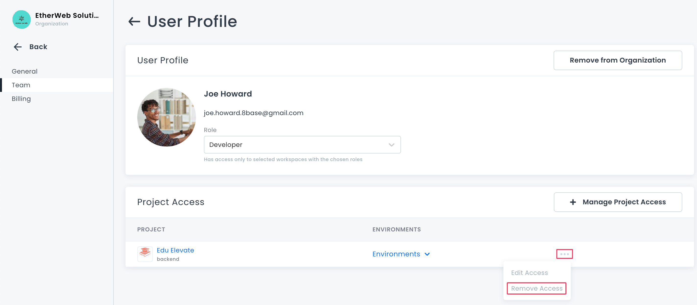
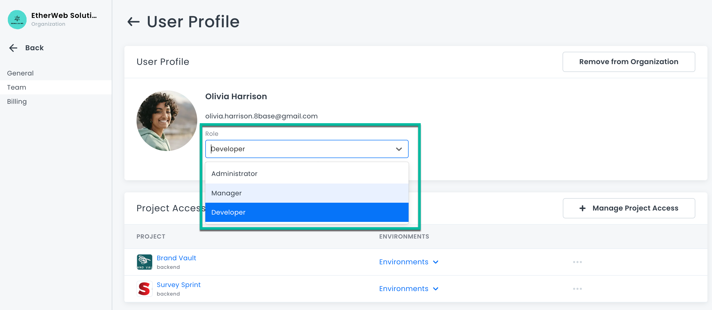

# Organization Team Management

Managing team members in an organization offers more granular control than at the project level. You can give team members different access rights in different projects, and even in different backend environments in the same project.

## Predefined Organization Roles
There are predefined roles in 8base:

-   **Owner**: Has access to everything. The Owner is usually the creator of the organization. 
:::note
The Owner is the only role that can update payment details.
:::    
-   **Administrator**: Has full access across all projects. This role can modify other member roles and access. Whenever a new environment or project is created, or a new administrator is added, they are automatically included.    
-   **Manager**: Has full access only to specified projects. They are automatically added to every environment of the designated project. Managers can also control Developer access within their assigned projects.    
-   **Developer:** Restricted to only those projects that are assigned to them by the organizations Manager or Administrator.
    
## Inviting New Members

Only Owners, Administrators, and Managers can invite new members.

1.  Navigate to **Organization -> Team**, and click **New**.

2.  Enter the invitees email, assign a role, and set their project access levels. Click **Send Invite** to finish.

Administrators do not need access configurations due to their universal access. 

Similarly, Managers are auto-added to all environments of designated projects.

The invitee receives the invitation via email. Team members who have not accepted an invitation have a status of **Pending**. If an invitation is pending, you can click the **...** menu to edit, re-send, or cancel the invitation.

## Managing Project Access

1.  Navigate to **Organization -> Team**. Choose a member, and click the **…** menu, select **User Profile**.

2.  To modify project access, select **Manage Project Access**.

3. Pick the desired project. 

4.  Set roles for each environment and save the changes. 

The project will then appear in the users profile project list.

Access levels can be edited or revoked at any time.

Click the *...* next to the project, and click **Remove Access**.

Owners and Administrators can also adjust roles for organization members via the **User Profile** section. Simply select a different role from the dropdown menu and confirm.
