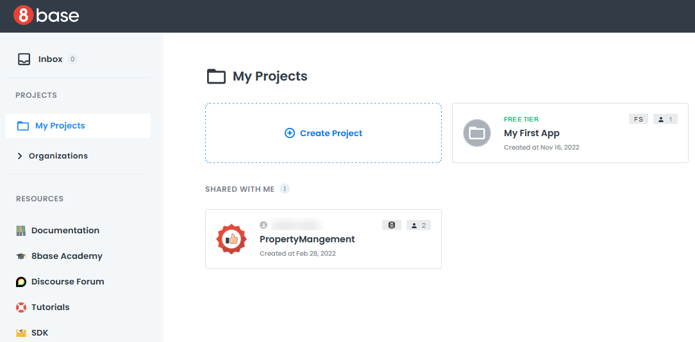

# Creating a New Project

A project is the container or workspace where you can develop and manage your applications. You can set up Full-Stack or Backend-Only project. 

## Overview

A project is where you:

- **Access your applications**: Define your data models, create business logic, and design user interfaces within the project.
- **Define your data**: Set structures, relationships, and access control rules within your project. You can manage and interact with your data through the project's data management capabilities.
- **Set user access**: Define user roles and permissions for your applications.
- **Deploy serverless functions**: Create and deploy serverless functions that run within your project, allowing you to add custom server-side logic to your applications.
- **Define API endpoints**: Define and expose API endpoints for your applications, making it easy to integrate with external services or create custom APIs.
- **Control authentication and authorization**: Projects offer built-in authentication and authorization features to secure your applications.
- **Deploy and host applications**: Publish your applications and make them available to users.

For more information about projects, see [Projects](../../introduction/04-projects.md).

## Creating a Project 

After you log in, the **My Projects** page loads and displays a list of all your projects. This page will be blank if you have not  created any projects. 

:::note
Before creating your first project, you should set up your payment details. Otherwise, you will be prompted during the project creation process.
:::

To create a new project:
1. Click **Create Project** in the upper left corner of the **My Projects** page.
2. A dialog box opens.

3. Enter a unique name for your project.
4. Choose your AWS region, either East or West. It is a best practice to choose a region that is geographically close to your users. This reduces latency, because data reaches the users more quickly.
5. Choose a project type: 
    - **Jumpstart with Accelerators**: Your project will have pre-built services and components such as authentication, user management, and notifications. 
    - **Build from Scratch**: Your project will be empty.    
6. If you choose **Build from Scratch**, you need to select an authentication method:
    -  **In-App Authentication**: Your application will control and manage the entire authentication process. This option is ideal for tailored experiences.    
    -  **Hosted Authentication**: Your application will have a cloud-hosted authentication interface, maintained and secured by 8base.    
    -  **DIY Authentication**: You will design your authentication process from the ground up. You can also choose to have no authentication.
7. Click **Next**. 
8. Choose your payment plan. Once you select a payment plan, a dialog box opens, showing project creation progress.

Once your project is created the dialog box closes and you are redirected to your project dashboard. Click **Start Building** to close the pop-up. You can now begin working on your new project.

To learn about the Project Dashboard interface, see [Project Dashboard Walkthrough](projects-dashboard-walkthrough.md).

## Related Articles

- [Authentication](../../backend/app-services/authentication-index.md)
- [Jumpstart with Accelerators](../../gettingstarted/jumpstart/jumpstart.md)