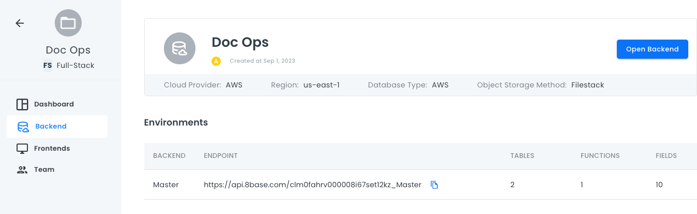

# Backend

The **Backend** page shows your different backend environments.

Click **Open Backend** to open your backend in a new browser tab.

In the **Environments** section, you can see your different backend environments, their endpoints, tables, functions, and fields.