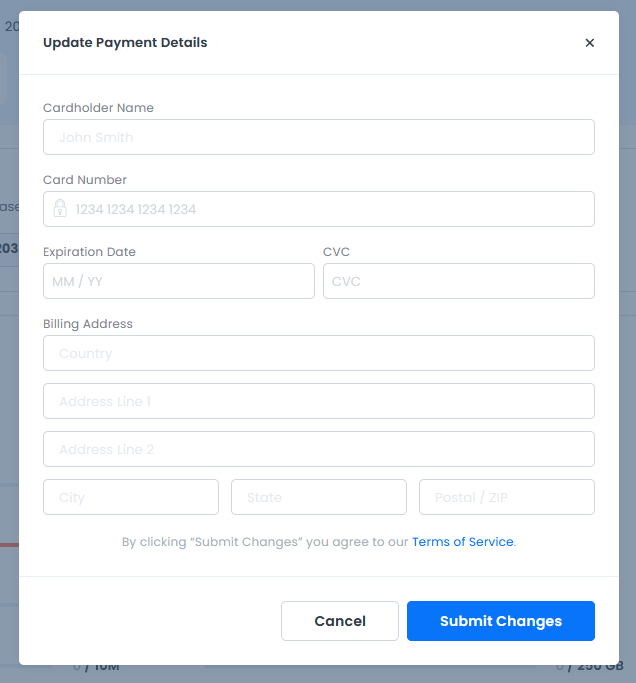
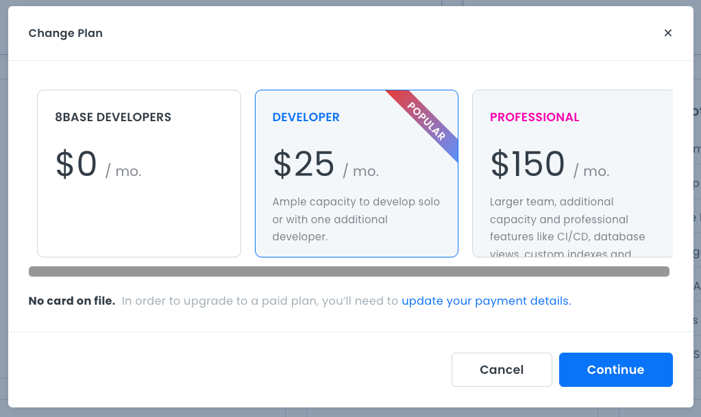
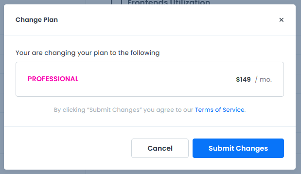

# Project Billing

On the **Billing** page, you can see your project usage, payment due dates, payment estimates, and billing history. 

## Payment Method

This area shows your current payment method. 

### Updating your Payment Method

Click the **Update** button in the **Payment Methods** section to update your payment details. A dialog box opens to allow you to change your payment details.

## Project Usage

This section shows your usage data and limits on different aspects of your project, such as the environment limit, number of team members, client user apps, and database rows. It also displays your plan type. 

### Changing your Current Plan
If you want to change your current plan, click on the **Change Plan** button in the **Project Usage** area. A dialog box opens and displays the available plans.

To select a new plan, click the **Continue** button. A confirmation dialog opens with your newly elected plan. 

Click **Submit Changes** to process the payment for your new plan.

Your payment will be processed, the project dashboard will reload, and your new plan will appear under the **Current Plan** heading.

## Estimated Due

This section shows an estimate of how much you will owe on your next bill, based on your current month-to-date usage after credits and prepayments.

## Billing History
This section shows a table with your past bills. Click **View** next to your current statement in the Billing History section to view a copy of your bill. A PDF of your bill opens in a new browser tab.