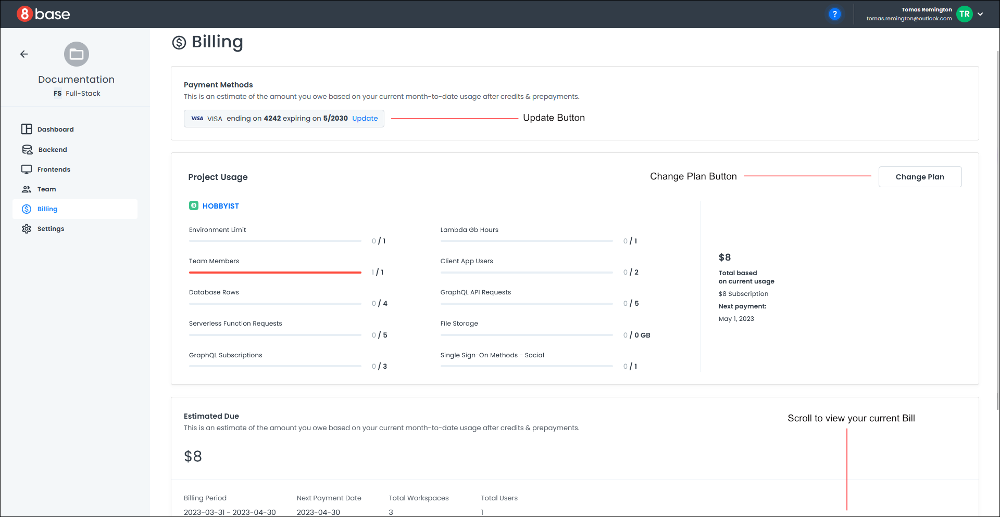

# Project Billing

#### Quotas
The project dashboard's *Quotas* area provides usage data and limits on different aspects of your project, such as the environment limit, number of team members, client user apps, and database rows. You can also access your *Billing* information.

To manage your *Billing* information, click the "Manage" link next to the quotas heading. A page opens with information about your payment method, project usage, billing period, and billing history. 

Click the "Update" button in the Payment Methods section to update your payment details. A pop-up opens to allow you to change your payment details.

Click the "Change Plan" button in the Project Usage section to change your payment plan. A pop-up opens that walks you through the steps of changing your plan.

Click "View" next to your current statement in the Billing History section to view a copy of your bill. A PDF of your bill opens in a new browser tab.

#### Current Plan
If you want to change your current plan, click on the "Change" link on the project dashboard next to the *Current Plan* heading. A pop-up opens and displays the available plans and your existing plan.

Click "Cancel" to abort changing your plan and the pop-up closes.

To select a new plan, click the "Continue" button. A confirmation dialog opens with your newly elected plan.

Click "Submit Changes" to process the payment for your new plan.

Your payment will be processed, the project dashboard will reload, and your new plan will appear under the *Current Plan* heading.
