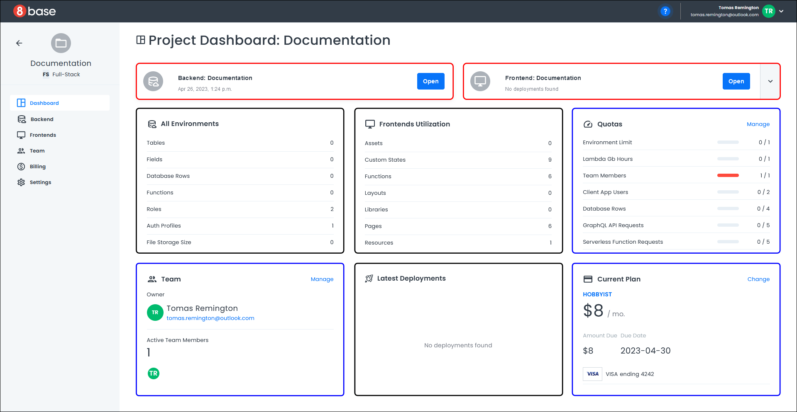
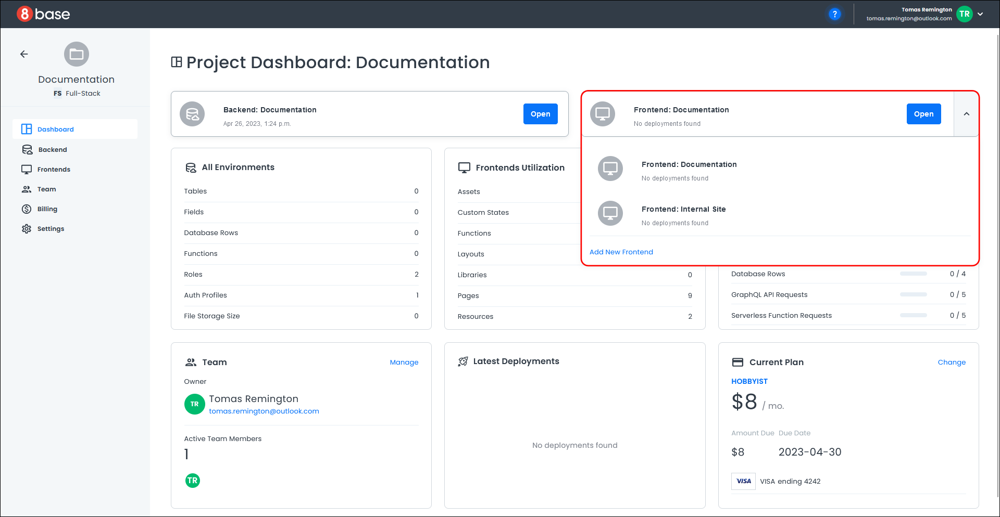

# Dashboard Walkthrough

The Project Dashboard is where you access everything related to your project. The screen is divided into a main page and a left-hand menu. 

The main page consists of your project's name, project information, project settings, and your backend and frontend applications. 

 
## Backend Application
To launch your backend application, click the **Open** button on the project dashboard next to the backend name. The backend application opens in a new browser tab. Here you can view your application quotas, start building your data model, define functions, set up user roles, use the API explorer to create GraphQL queries, and get help from the 8base community.

## Frontend Application
To launch your frontend application, click the **Open** button on the project dashboard next to the frontend name. The App Builder opens in a new browser tab, and you can now begin designing your frontend application.

If you have more than one frontend, click the down arrow next to the current frontend name, this displays a list of all your frontends.

Select the frontend you want to work with and click the **Open** button. The App Builder opens in a new browser tab (as seen above).

## All Environments
The project dashboard's **All Environments** area provides information about your project roles, authorization profiles, file storage size, and database information for your backend application. There will only be database information if you have a backend application.

## Frontends Utilization
The project dashboard's **Frontends Utilization** area provides information about the assets, layouts, libraries, pages, etc., used by your frontend applications.

## Quotas
The project dashboard's **Quotas** area provides usage data and limits on different aspects of your project, such as the environment limit, number of team members, client user apps, and database rows. You can also access your **Billing** information.

To manage your **Billing** information, click the **Manage** link next to the quotas heading. A page opens with information about your payment method, project usage, billing period, and billing history. 

## Latest Deployments
The project dashboard's **Latest Deployments** area provides information about your frontend deployments over the last week. The date and time of deployment, the current application version, and the project name are all displayed.

## Current Plan
If you want to change your current plan, click on the **Change** link on the project dashboard next to the **Current Plan** heading. A pop-up opens and displays the available plans and your existing plan.

Click **Cancel** to abort changing your plan and the pop-up closes.

To select a new plan, click the **Continue** button. A confirmation dialog opens with your newly elected plan.

Click **Submit Changes** to process the payment for your new plan.

Your payment will be processed, the project dashboard will reload, and your new plan will appear under the **Current Plan** heading.

## Left-hand Menu
The left-hand menu contains your project's name and links to access and launch your backend or frontend application, manage your team, view your billing information, or change your project settings.

### Dashboard
The **Dashboard** link opens the Project Dashboard.

### Backend
The **Backend** link opens a page with information about your backend, such as the Cloud Provider, Database Type, Endpoint, and the number of tables, functions, and fields in your database.

Click the **Open** button in the top right corner of the page to open your backend application in another browser tab.

For more information, see [Backend](projects-backend-ui.md).

### Frontends
The **Frontends** link opens a page listing your frontends and deployment information for each frontend. 

Click the **Open** button on one of your listed frontends to open your frontend in the App Builder. 

For more information, see [Frontend](projects-frontend-ui.md).

### Team
The **Team** link opens a page with information on your project's team members. The workflow to manage your team is the same as from the **Team** section on the project dashboard.

For more information, see [Team Management](projects-team-management.md).

### Billing
The **Billing** link opens a page with billing information for your project. The workflow to manage your billing information is the same as from the **Quotas** section on the project dashboard.

For more information, see [Billing](projects-billing.md).

### Settings
The **Settings** link opens a page with information about your project, such as the project name, a description, and a custom project icon.

For more information, see [Settings](projects-settings.md).
