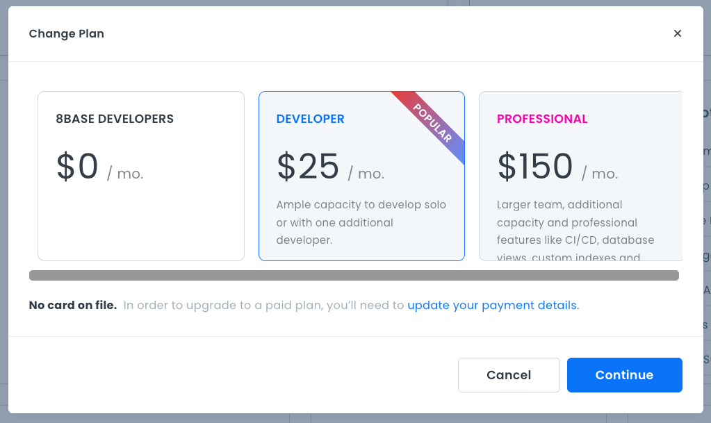

# Project Dashboard Walkthrough

The **Project Dashboard** is where you access everything related to your project. The screen is divided into a main page and a left-hand menu. 

The main page consists of your project's name, project information, project settings, and your backend and frontend applications. 

## Main Page

### Backend
To launch your backend, click the **Open** button on the Project Dashboard next to the backend name. The backend opens in a new browser tab. Here you can view your application quotas, start building your data model, define functions, set up team roles, use the API explorer to create GraphQL queries, and get help from the 8base community.

### Frontend
To launch a frontend, click the **Open** button on the Project Dashboard next to the frontend name. The App Builder opens in a new browser tab.

If you have more than one frontend, click the down arrow next to the current frontend name. This displays a list of all your frontends.

Select the frontend you want to work with and click the **Open** button. The App Builder opens in a new browser tab.

### All Environments
The **All Environments** area provides information about your project roles, authorization profiles, file storage size, and database information for your backend application. You will only see this area if you have a backend application.

### Frontends Utilization
The **Frontends Utilization** area provides information about the assets, layouts, libraries, pages, etc., used by your frontend applications.

### Quotas
The **Quotas** area provides usage data and limits on different aspects of your project, such as the environment limit, number of team members, client user apps, and database rows. You can also access your **Billing** information.

To manage your **Billing** information, click the **Manage** link next to the quotas heading. A page opens with information about your payment method, project usage, billing period, and billing history. 

### Team
To manage your project Team, click the **Manage** link next to the team heading. A page opens with information about your current project's team members.

### Latest Deployments
The **Latest Deployments** area provides information about your frontend deployments over the last week. The date and time of deployment, the current application version, and the project name are all displayed.

### Current Plan
If you want to change your current plan, click on the **Change** link next to the **Current Plan** heading. A dialog box opens and displays available plans and your existing plan.

To select a new plan, click the **Continue** button. A confirmation dialog opens showing your newly elected plan.

Click **Submit Changes** to process the payment for your new plan.

Your payment will be processed, the Project Dashboard will reload, and your new plan will appear under the **Current Plan** heading.

## Left-hand Menu

### Dashboard
The **Dashboard** link opens the Project Dashboard.

### Backend
The **Backend** link opens a page with information about your backend, such as the Cloud Provider, Database Type, Endpoint, and the number of tables, functions, and fields in your database. Click the **Open** button in the top right corner of the page to open your backend application in another browser tab.

For more information, see [Backend](projects-backend-ui.md).

### Frontends
The **Frontends** link opens a page listing your frontends and deployment information for each frontend.  

For more information, see [Frontend](projects-frontend-ui.md).

### Team
The **Team** link opens a page with information on your project's team members. 

For more information, see [Team Management](projects-team-management.md).

### Billing
The **Billing** link opens a page with billing information for your project.

For more information, see [Billing](projects-billing.md).

### Settings
The **Settings** link opens a page with information about your project, such as the project name, a description, and a custom project icon. This is where you can delete the project.

For more information, see [Settings](projects-settings.md).
