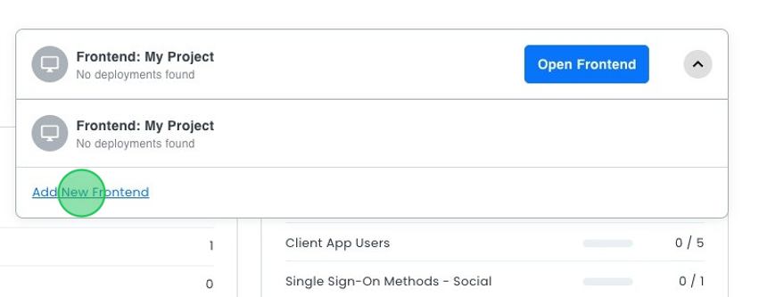
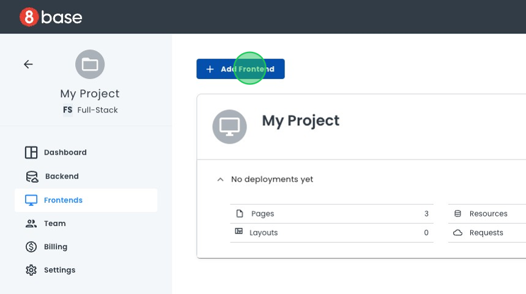
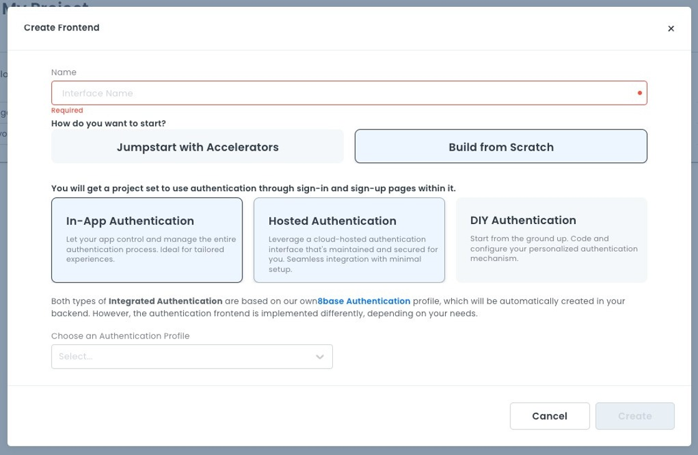

# Creating a New Frontend

You can add a new frontend to your project in the **Project Dashboard** or the **Frontends** page.

1. There are two ways to get started:
   - In the Project Dashboard, go to the Frontends list. Click the down arrow next to the current frontend name. A list of all your frontends displays. Click **Add New Frontend** at the bottom of the list.
    
   - On the Frontends page, click the **Add Frontend** button in the upper left corner of the page.
    
2. A dialog box opens. Type in a name for your frontend. 
3. Choose one of the following options: 
    - **Jumpstart with Accelerators**: Your Frontend will have pre-built services and components such as authentication, user management, and notifications. 
    - **Build from Scratch**: Your Frontend will be empty.    
4. If you choose **Build from Scratch**, you need to select an authentication method:
    -   **In-App Authentication**: Your application will control and manage the entire authentication process. This option is ideal for tailored experiences.    
    -   **Hosted Authentication**: Your application will have a cloud-hosted authentication interface, maintained and secured by 8base.    
    -   **DIY Authentication**: You will design your authentication process from the ground up. You can also choose to have no authentication.
    
5. Click **Create**. A dialog box opens, showing Frontend creation progress.
6. The dialog box closes once your new frontend is ready.

Your new frontend displays in the frontend drop-down list on the **Project Dashboard**
and the **Frontend Listing** page.

## Related Articles

- [Authentication](../../backend/app-services/authentication-index.md)
- [Jumpstart with Accelerators](../../gettingstarted/jumpstart/jumpstart.md)

