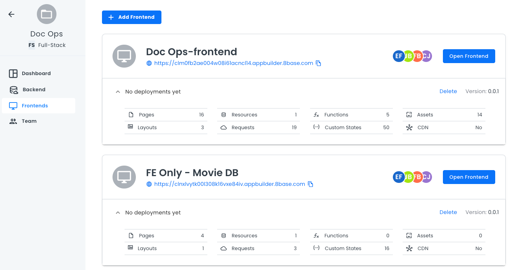

# Frontend

The **Frontend** page shows your different frontend applications.

Each frontend table will list pages, layouts, resources, requests, functions, custom states, assets, and CDN. You can also see when the frontend was deployed.

Click **Open Frontend** to open a specific frontend in a new browser tab.

To learn about creating new frontends, see [Creating a New Frontend](projects-frontend-creation.md).

