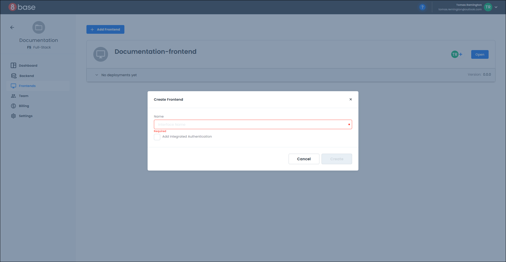
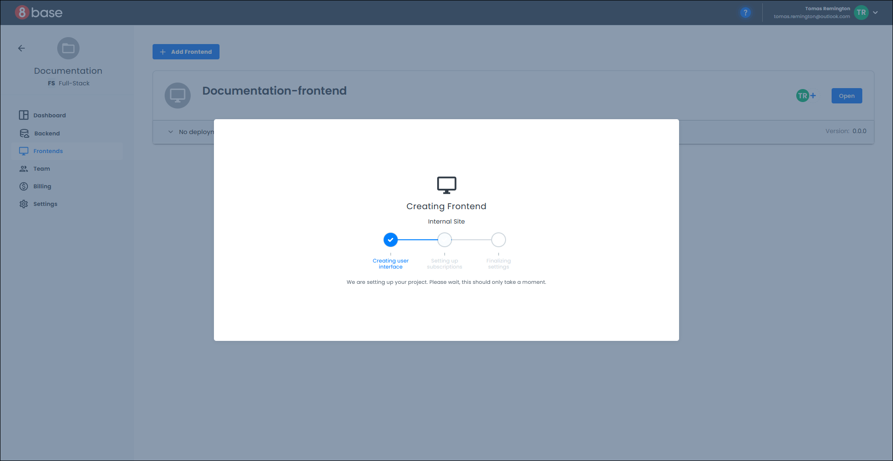
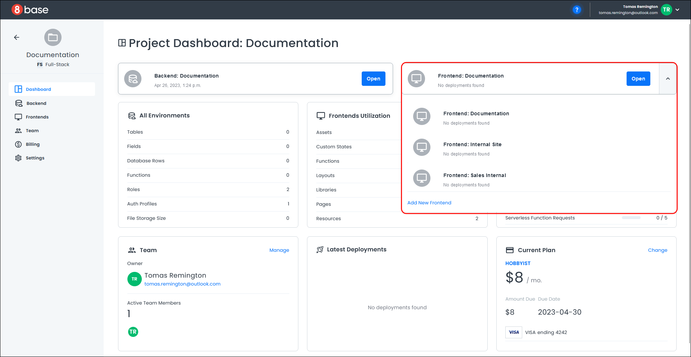
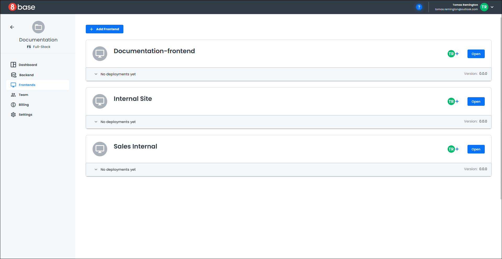

# Settings

#### Settings Link
The *Settings* link opens a page with information about your project, such as the project name, a description, and a custom project icon.

Directly within this page, you can change your project name and description. Remember to click "Save" to save any changes you make.

Click the icon next to the project information to change your project icon. A ***File Open*** dialog opens in a pop-up that allows you to select a new icon.

If you want to delete your project, click the "Delete" button, and a confirmation pop-up opens.

Click "Cancel" to cancel deleting the project and close the pop-up.

Enter the project name and click "Delete" to delete the project. A confirmation message indicates the project was successfully deleted, and you are redirected to the My Projects screen.

### <a id="adding-a-frontend">Adding a Frontend</a>
You can add a new frontend from either the *Project Dashboard* or the *Frontends Listing* page.

**Start Flow A:** *Project Dashboard > Frontend Drop-down List*

Click the down arrow next to the current frontend name on the project dashboard. A list of all your frontends displays; click "Add New Frontend" at the bottom of the list.

**Start Flow B:** *Menu > Frontend Listing*

Click the *Frontends* link on the menu to open the *Frontend Listing* page. Click the "Add Frontend" button in the upper left corner of the page.

**Common Flow:**

A pop-up opens for you to input the name of your frontend and enable integrated authentication if required.

Click the "Cancel" button to cancel adding a frontend and close the pop-up.

Click the "Create" button to bring up the *Frontend Creator*, which steps through creating your new frontend. 

The *Frontend Creator* closes once your new frontend is ready.

**End Flow A:**

Your new frontend displays in the frontend drop-down list on the *Project Dashboard*.

**End Flow B:**

Your new frontend displays on the *Frontend Listing* page.

