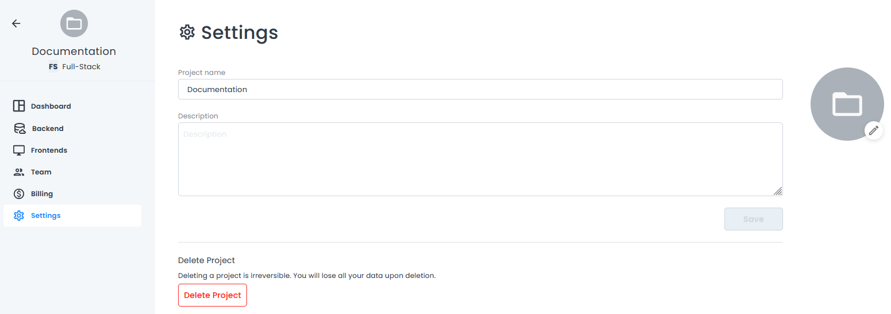
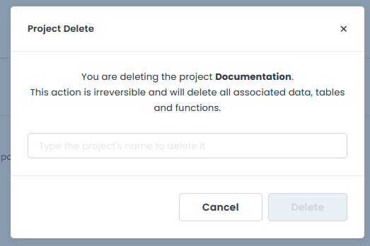

# Project Settings

On the **Settings** page, you can change your project name, description, and icon. You can also delete the project.

When you change the name or description, remember to click **Save**.

Click the project icon on the right to change the icon. If you have never added an icon, a blank folder will display.

If you want to delete your project, click the **Delete** button. A confirmation dialog box opens.

Enter the project name and click **Delete** to delete the project. A confirmation message indicates the project was successfully deleted, and you are redirected to the **My Projects** screen.
