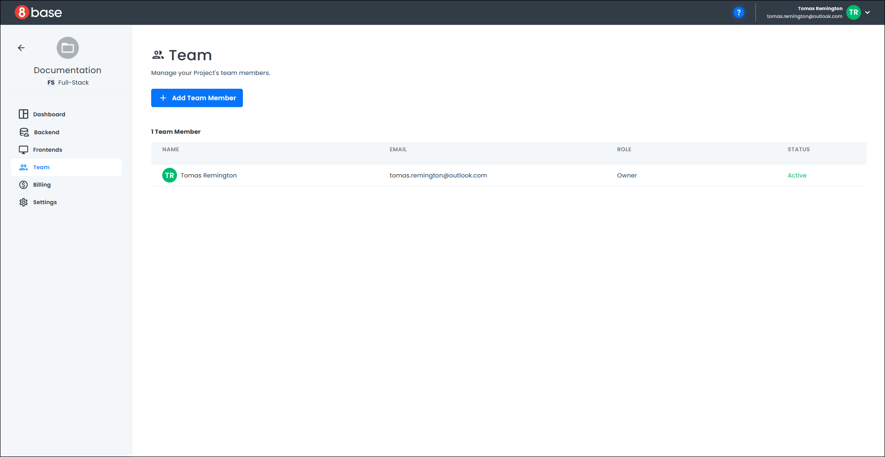
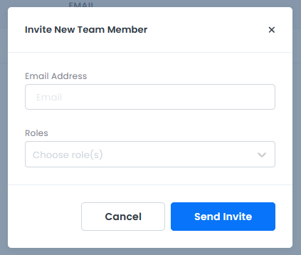
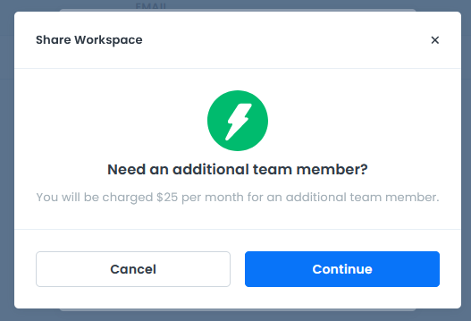

# Team Management

To manage your project *Team*, click the "Manage" link on the project dashboard next to the team heading. A page opens with information about your current project's team members.

To add a new team member, click the "Add a Team Member" button, which opens a pop-up that allows you to add a new team member to your project.

Complete the form in the pop-up and click "Send Invite". A notification displays, indicating the cost for adding a new team member.

Click "Cancel" to cancel adding the team member and close the notification.

Click "Continue" to send the invitation and close the notification. A confirmation message at the bottom of the *Team* page indicates the invitation was sent.

The next time you login and view the *Team* page, the new team member's name will be listed. Team members who have yet to accept an invitation have a status of *Pending*.
