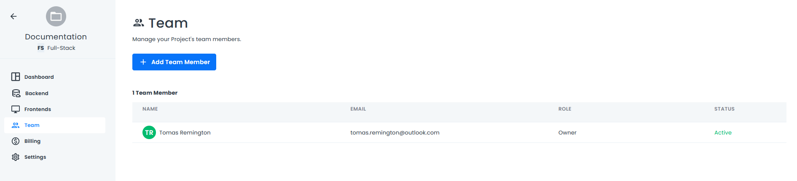

# Team Management

Team Members are individuals who work together to develop applications in 8base. Their roles define permissions within the 8base Project Dashboard.

You can open the Team Management page from the Project Dashboard. If you are a project Administrator, you can configure team roles and invite team members to the project.

## Inviting Team Members

To add a new team member, click the **Add a Team Member** button.

Complete the form in the dialog box and click **Send Invite**. A notification displays, indicating the cost for adding a new team member.

Click **Continue** to send the invitation. A confirmation message at the bottom of the page indicates the invitation was sent. Click **Cancel** to cancel adding the team member and close the dialog box.

The next time you login and view the **Team** page, the new team member's name will be listed. 

Team members who have not accepted an invitation have a status of **Pending**. If an invitation is pending, you can click the **...** menu to edit, re-send, or cancel the invitation. 

## Managing Team Members

Team members can be updated and removed by clicking the *...** menu next to their **Status** column. Updating a team member's roles will effect their permissions within the project. Deleting a team member will **only** disassociate a developer from the current project. Their 8base developer account will remain intact.

## Team Member Roles and Permissions

For information about team roles, see [Teams](../../backend/8base-console-teams.md).
