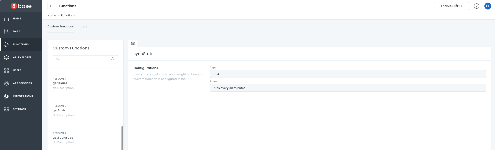

# Custom Functions

Custom functions extend and enhance your projects. For example, you can use custom functions to extend your GraphQL API, add custom endpoints, or build new server-side functionality. 

Custom functions in 8base are essentially AWS lambdas that get enriched with access to your workspace resources. For example, 8base makes sure you are able to access the workspace's environment variables and database from within a custom function by default. Custom functions can be written in either JavaScript or TypeScript and be deployed in a matter of minutes.

All custom functions must be declared in your projects 8base.yml file.

## Highlights

- **Serverless Execution:** Scale custom functions from 1 to 1,000,000+ calls, thanks to serverless design.
- **JavaScript and TypeScript:** Write in JavaScript or TypeScript, and 8base will compile it as needed.
- **Predefined Triggers:** Choose from four types of custom function triggers.
- **Easily Permissioned:** Configure custom functions easily in the **Role Manager**.

## Custom Function Types

There are four types of custom functions:

- [Resolvers](/backend/custom-functions/resolvers/): Resolvers fetch data from any data source, then transform that data into the shape you need. This means you can make custom queries and mutations. For example, you can build a resolver that queries the 8base GraphQL API for a user with a specific ID.
- [Webhooks](/backend/custom-functions/webhooks/): Webhooks are a system for how one server can notify another server when something happens. For example, if your app has a payment processing service, a webhook can notify your app of a successful payment by calling a given URL.
- [Triggers](/backend/custom-functions/triggers/): Triggers let you automate actions when an incoming request matches specific conditions. For example, you could set a trigger that sends a welcome message when a new user is added to your app.
- [Tasks](/backend/custom-functions/tasks/): Tasks are long-running operations that can be run based on a schedule or another function (such as a trigger). For example, you could schedule a task which sends an email every day at 5pm, listing all sales made.

## Viewing your Custom Functions

You can open the **Functions Dashboard** from the sidebar. This is your catalog for any custom server-side logic. All custom functions that have been deployed to a workspace can be reviewed. 



### Custom Function Cards

Once custom functions have been deployed to a workspace, they will appear in a list on the left side of the **Functions Dashboard**. Selecting a function will display the function's details on a card to the right of the functions list.

Function details include: `type`, `description`, and relevant metadata (configurations). Most importantly, clicking on the `Logs` tab will display the function's production logs.

### Descriptions and Metadata

All descriptions and metadata attributed to a function must be added/updated inside the `8base.yml` file. There is currently no support for editing functions in the 8base console.

Check out the [8base.yml docs](../development-tools-dev-env-8base-yml.md)
 to learn more about deploying functions to a workspace.

### Logs
You can access your custom function logs by clicking the **Logs** tab. For more information, see [Logs](custom-functions/custom-functions-logs.md)

## Custom Function Arguments

All custom functions receive the same function arguments when invoked; _event_ and _ctx_. These arguments are positional, so you can rename them.

#### event

When a custom function is invoked, 8base will attempt to parse the request body and query string to add any parsed values to `event.data` attribute. However, the raw request body will always be available on at `event.body`. The `event` argument can be expected to have the following structure:

```json
{
  "event": {
    "data": {
      "arg1": "arg1 value",
      "arg2": "arg2 value"
    },
    "headers": {
      "x-header-1": "header value",
      "x-header-2": "header value"
    },
    "body": "raw request body"
  }
}
```

#### ctx

The context argument - `ctx` - exposes 8base GraphQL and other APIs. It can be used to run queries and mutations from inside the custom function and to call other functions.

```javascript
// Code...
ctx.api.gqlRequest(QUERY, { ...variables });
```

The `gqlRequest` method accepts an optional options object as it's third argument. On that `options` object, the `checkPermissions` option is available. By default, `checkPermissions=true` and any query run from inside the function gets scoped to the requester's permissions. When set to `false`, the query runs without checking permissions.

```javascript
if (runWithRolesEnforced) {
  ctx.api.gqlRequest(QUERY, VARIABLES);
} else if (runWithoutRolesEnforced) {
  ctx.api.gqlRequest(QUERY, VARIABLES, { checkPermissions: false });
}
```

For security reasons, `checkPermissions` is ONLY available from within custom functions. It cannot be used when making requests from client applications.

As opposed to using the `checkPermissions` option, [API Tokens](/backend/roles-and-permissions/#api-tokens) associated with defined roles can be used to permission `gqlRequest` calls. This ability accommodates situations where permissions are required, but not in the context of the requesting user. To accomplish this, the API Token can be added as a bearer token to the call.

```javascript
await ctx.api.gqlRequest(QUERY, VARIABLES, {
  headers: {
    Authorization: 'Bearer <MY_API_TOKEN>',
  },
});
```

## Timeouts

All custom functions types have a default maximum execution  of 20 seconds. After the execution time limit is reached, the execution times out and returns an error.

If you need more than 20 seconds of continuous execution, you can increase your timeout up to 900 seconds by specifying it in `8base.yml`. Check out the example in [8base Config](/backend/development-tools/dev-env/8base-yml/).

In some cases, you can reach a timeout when executing several functions sequentially. In order not to await them, you can spawn background tasks using the `context.invokeFunction` API in [Tasks](/backend/custom-functions/tasks/).

Sometimes your function reaches the 20 second limit and also must be executed sequentially. In that case, to not spread the logic of the function across multiple tasks you could make one task and run it multiple times in a recursive manner as shown below:

```javascript
// Create `myLongTask` that contains all your logic
module.exports = async (event, ctx) => {
  const { param1, param2, param3, subtask = 'operation1' } = event.data;

  switch (subtask) {
    case 'operation1': {
      // first part of the long-run task
      console.log(param1);
      // run the next part
      await ctx.invokeFunction(
        'myLongTask',
        {
          subtask: 'operation2',
          param2: 'world',
        },
        {
          waitForResponse: false,
        }
      );
      break;
    }
    case 'operation2': {
      // second part of the long-run task
      console.log(param2);
      // run the next part
      await ctx.invokeFunction(
        'myLongTask',
        {
          subtask: 'operation3',
          param3: '!!!',
        },
        {
          waitForResponse: false,
        }
      );
      break;
    }
    case 'operation3': {
      // third part of the long-run task
      console.log(param3);
      break;
    }
    default: {
      throw new Error(`Subtask ${subtask} not found`);
    }
  }

  return {
    data: {
      result: `${subtask}: done`,
    },
  };
};

// In some other custom function run that task
await ctx.invokeFunction(
  'myLongTask',
  {
    param1: 'Hello',
  },
  {
    waitForResponse: false,
  }
);
```

## Managing Dependencies

8base deploys custom functions to a Node.js 14 [runtime environment](/backend/development-tools/dev-env/runtime-environment#supported-languages-and-runtime/) in which any compatible NPM dependencies are supported. On deploy, the system will check whether or not your dependencies have been installed and handle that accordingly. As expected, deploys run significantly faster when dependencies are installed locally. Feel free to use either NPM or Yarn as your package manager during development.

## Best Practices

Custom functions are developed in a local development environment and then deployed to a given workspace using the [8base CLI](/backend/development-tools/cli/). When in development, they can be invoked locally for testing purposes.

Using the `8base generate` command is recommended when creating new functions. Doing so provides a recommended folder structure that helps keep everything organized when developing custom functions locally, including a `mocks` directory and management of the `8base.yml` file.

```bash
$ 8base generate resolver findPossumly

=> Updated file 8base.yml
Created file src/resolvers/findPossumly/handler.ts
Created file src/resolvers/findPossumly/mocks/request.json
Created file src/resolvers/findPossumly/schema.graphql

Boom! Your new findPossumly function has been successfully generated.
To add any required settings, check out its configuration block in your projects 8base.yml file.
```

Inside a functions `handler.(js|ts)` file the command that is needed to begin invoking the function locally get generated automatically, along with the required resources for its execution. The benefit of this is the ability to quickly test your functions locally using the CLI and a well-defined request object.

```javascript
/**
 * src/resolvers/findPossumly/handler.ts
 *
 * To invoke this function locally, run:
 *  8base invoke-local findPossumly -p src/resolvers/findPossumly/mocks/request.json
 */

// Code...
```
