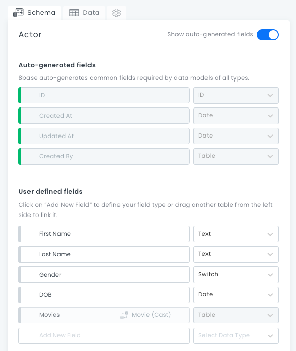
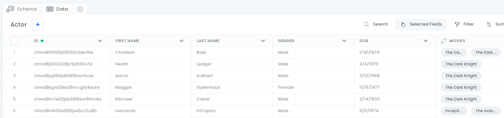
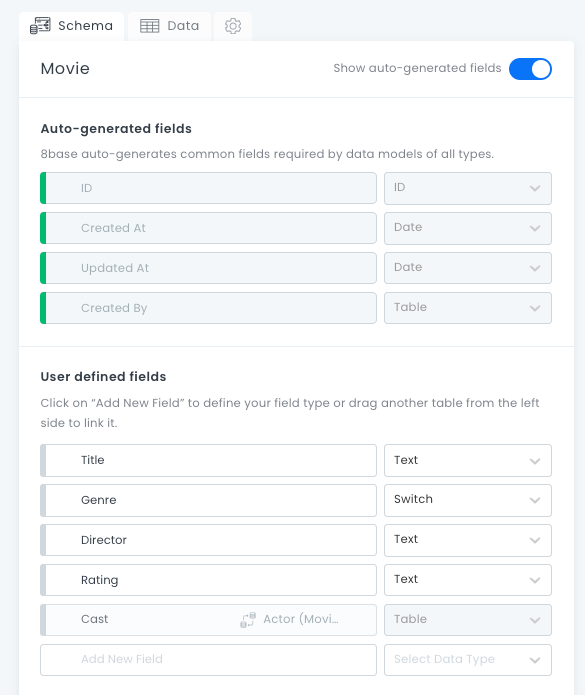
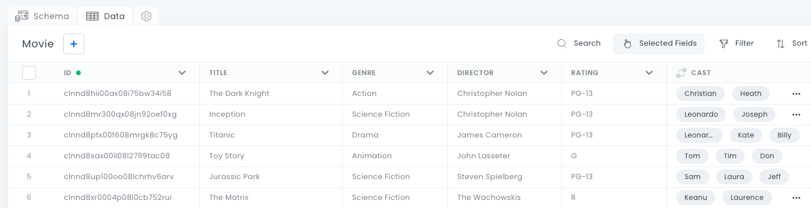
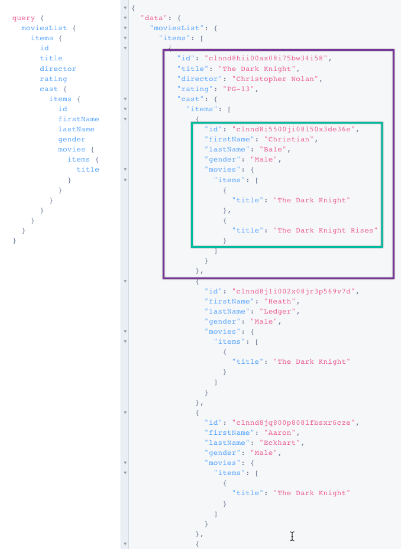
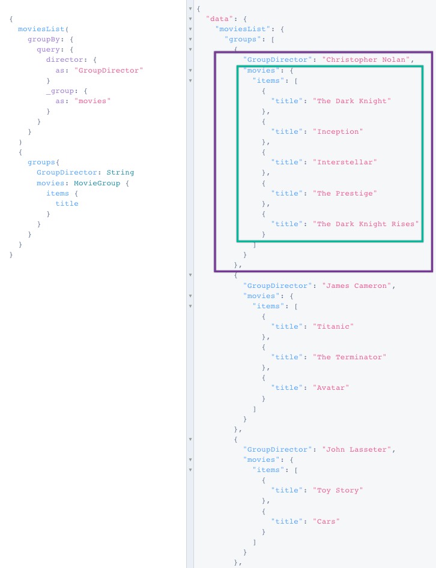
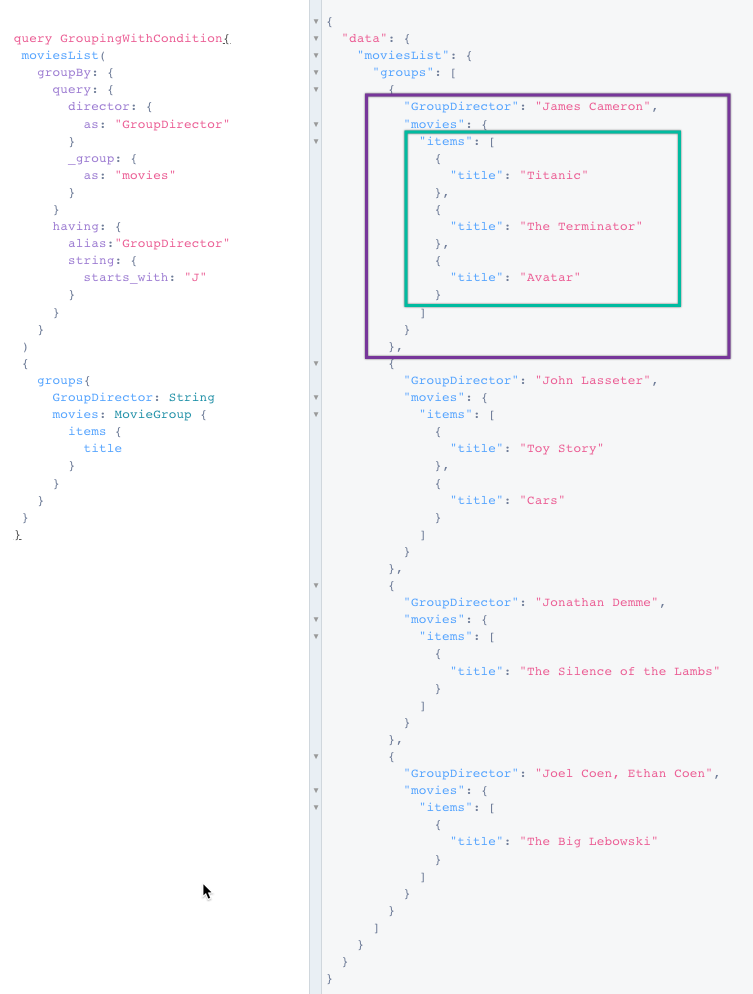
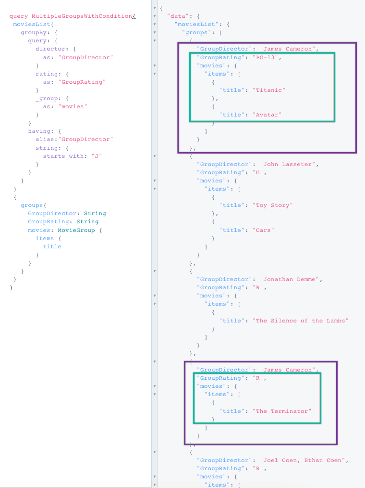
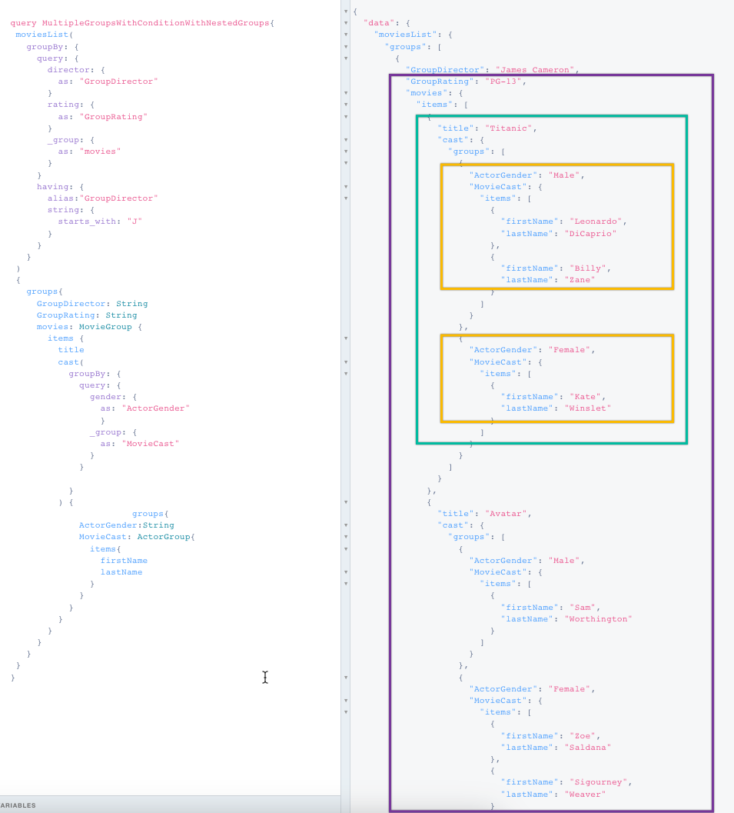

# Tutorial: Using Groups and Aggregations in Queries

Groups and aggregations help you gain valuable insights from your data, in order to improve business processes, customer experiences, and overall efficiency.

Groups are an 8base feature that does not come in standard GraphQL. Groups can summarize and analyze large datasets, highlighting patterns in your data. Groups can also pinpoint anomalies and outliers. This information can be used in reports and dashboards to quickly assess the state of a business or application without diving into detailed data. This improves your ability to, for example, build customer segments based on various criteria like demographics, behavior, or purchase history.

Aggregations improve query performance by reducing the amount of data that needs to be processed. Instead of processing every data point, you can retrieve aggregated results, which is crucial in large datasets. 


## What You Will Learn

We will create simple and complex queries that fetch movie information. This tutorial will show ways to filter and re-organize your data to get more specific results. You will also learn to find insights that would be impossible to find if you were searching your entire dataset. 


## The Data

In this tutorial, we are using data about movies. There are two tables: **Actor** and **Movie**.

If we look at the **Actor** table, on the **Schema** tab, we can see our auto-generated fields and user-defined fields. The first column displays the field names, and the second column lists the field types.




The field type will affect how the field can be configured and behaves. The field type also affects the kind of data you can receive from a field. For more information, see [Field Types](https://docs.8base.com/projects/backend/console/data-builder/#field-types). 

On the **Data** tab, we can see our data. Each data entry has the following columns:


* ID
* First Name 
* Last Name 
* Gender
* DOB (Date of Birth)
* Movies (this column links to the Movies data table)




If we view the **Movies** data table, the schema looks like this:




The **Cast** field is a table that is being pulled from the Actor data table. The Movie table data has these columns:


* ID
* Title 
* Genre
* Director
* Rating
* Cast (this column links to the Actors data table)





## Running a Simple Query that Retrieves all Movie Data

First, let’s run a query to show what our results are when we do not group anything. In the API Explorer, we will type in this query:

```javascript
query {
 moviesList{
   items{
     id
     title
     director
     rating
     cast {
       items {
         id
         firstName
         lastName
         gender
         movies {
           items{
             title
           }
         }
       }
     }
   }
 }
}
```


To run a query, click the **Execute query** button. 

The query has returned all of the data, sorted in the order specified in the query. The results are listed first by field ID of the movie, and then a sub-section listing actor names, also in order of ID number. 

> **Tip:** In 8base, if you do not specify a sort order, the default is to sort items by ``created_at``.




There is nothing wrong with these results, but is ordering everything by ID number the most practical way to sort results? If you are trying to decide what movie to watch, those ID numbers do not help you.

Let’s use groups to organize and filter the data in a more usable way.


## Creating a Simple Group

Now we will write a new query to get a list of movie titles organized by director name. To do this, we need to add two elements: 


* Query field: `moviesList` (this replaces `query` in the first example)
* Argument: `groupBy`

Groups are defined in the `groupBy` argument of the table list query, `moviesList`. The `groups{ }` argument is what sets the sort order. Here, `GroupDirector` is first, followed by `MovieGroup` items by title.


```javascript
{
  moviesList(
    groupBy: {
      query: {
        director: {
          as: "GroupDirector"
        }
        _group: {
          as: "movies"
        }
      }
    }
  )
  {
    groups{
      GroupDirector: String
      movies: MovieGroup {
        items {
          title
        }
      }
    }
  }
}
```


> **Tip:** If you want to quickly build a query, click the **Explorer** button and use the list on the left to add fields, groups, and aggregations.

Our new results give us a list of directors, and which movies they directed:




These results are sorted alphabetically by the first name of the director. This is a more logical way to present information than field ID. You can also see quick insights: this data shows that Christopher Nolan has directed more movies than James Cameron. 

This list has the same number of data points as our first query, but they are sorted in a more logical way. If we are picking a movie to watch, we will want fewer results to sort through. 


## Grouping with a Single Condition

Creating a grouping with conditions allows you to filter your results based on a specific criteria. The `having` argument is a tool for adding filters that use aggregated or aliased fields. Unlike filters, the `having` clause is applied after the `groupBy` operation. 

The next query will only return the results of directors whose first names start with J. To do this our query starts with the `query field GroupingWithCondition.`


```javascript
query GroupingWithCondition{
 moviesList(
   groupBy: {
     query: {
       director: {
         as: "GroupDirector"
       }
       _group: {
         as: "movies"
       }
     }
     having: {
       alias:"GroupDirector"
       string: {
         starts_with: "J"
       }
     }
   }
 )
 {
   groups{
     GroupDirector: String
     movies: MovieGroup {
       items {
         title
       }
     }
   }
 }
}
```


The `having` clause states that the query should only return items in `GroupDirector` that start with J. The groups argument is the same as in the previous example.

Our results come back with four directors: James Cameron, John Lasseter, Jonathan Demme, and Joel Cohen. 





You can use grouping by condition to create categories in your data. For example, you could search for directors who released movies in the 1980s, directors whose first names are “John”, or directors who make PG rated movies. 


## Grouping with Multiple Conditions

Next, we will run a query with more than one condition. We only want results where the director name starts with J. And we want the movie title results to be sorted by film rating: G, PG, PG-13, R.  

To do this, we use:


* Query field: `MultipleGroupsWithCondition{. `
* New group arguments: `GroupDirector` and `GroupRating`

```javascript
query MultipleGroupsWithCondition{
 moviesList(
   groupBy: {
     query: {
       director: {
         as: "GroupDirector"
       }
       rating: {
         as: "GroupRating"
       }
       _group: {
         as: "movies"
       }
     }
     having: {
       alias:"GroupDirector"
       string: {
         starts_with: "J"
       }
     }
   }
 )
 {
   groups{
     GroupDirector: String
     GroupRating: String
     movies: MovieGroup {
       items {
         title
       }
     }
   }
 }
}
```


In our results, James Cameron now appears twice: Once in a section listing his PG-13 movies, and once in a section showing his one rated R movie. 




Now that we know the movie ratings, we can pick a movie that is appropriate to watch with our grandparents. But our grandparents will want to know which actors are in these movies, so we need to add nested groups to our query.


## Creating Nested Groups

Groups can be nested as much as required. We already have a list of movies filtered by director name and rating, but we also want to know which actors and actresses appear in these movies. And we want to separate the list by gender, to make it easier to read. 

The first part of the query is similar to the last one. You need to change the query field, and add a new, nested groupBy argument to add the actors and their gender:


* Query field: `MultipleGroupsWithConditionWithNestedGroups`
* Two group arguments: `ActorGender` and `ActorGroup`

```javascript
query MultipleGroupsWithConditionWithNestedGroups{
 moviesList(
   groupBy: {
     query: {
       director: {
         as: "GroupDirector"
       }
       rating: {
         as: "GroupRating"
       }
       _group: {
         as: "movies"
       }
     }
     having: {
       alias:"GroupDirector"
       string: {
         starts_with: "J"
       }
     }
   }
 )
 {
   groups{
     GroupDirector: String
     GroupRating: String
     movies: MovieGroup {
       items {
         title
         cast(
           groupBy: {
             query: {
               gender: {
                 as: "ActorGender"
                 }
               _group: {
                 as: "MovieCast"
               }
             }
            
           }
         ) {
                       groups{
             ActorGender:String
             MovieCast: ActorGroup{
               items{
                 firstName
                 lastName
               }
             }
           }
         }
       }
     }
   }
 }
}
```

Our results now show a lot of information. Here is a snapshot showing James Cameron’s PG-13 movies:




The entries are still grouped by the director’s first name and then movie rating. Then you see the movie title, a list of actors, and a list of actresses. 

Our first query gave us a huge list of movies, organized by ID, with no filtering. Now we can quickly scan a smaller list of movies, and pick one based on director, rating, and actor or actress.


## Related Articles


* [Grouping and Aggregations](https://docs.8base.com/projects/backend/graphql-api/grouping-and-aggregations) 
* [Grouping and Aggregations on the GraphQL API](https://www.8base.com/8base-academy/grouping-and-aggregations-on-the-graphql-api) 