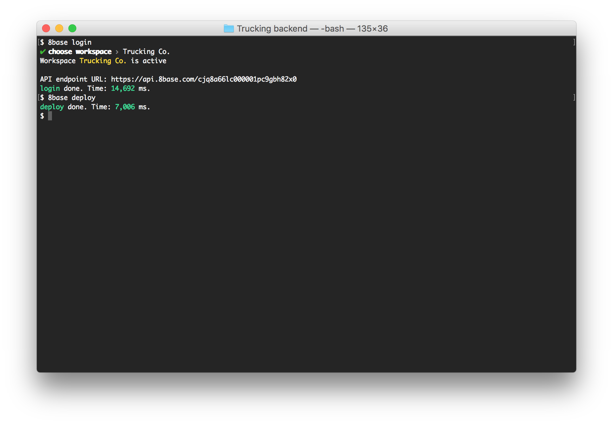

# Advanced Development

8base offers advanced features that help developers interact with their schemas and functions.

The Command-line Interface (CLI) allows you to develop and deploy custom backend logic in JavaScript or TypeScript. Need to run a custom algorithm, connect to a third-party API, or execute a task on schedule? The CLI lets you deploy this logic in seconds to 8base serverless environment where it is executed and scaled automatically.

The 8base SDK and Boost UI Kit provide a set of open-source libraries and UI components that simplify and accelerate front-end development. Libraries and UI components are pre-integrated with the 8base API to enable useful features, such as automatically applying client-side validation to form fields based on your data schema, seamless file uploads and more.

Here's a brief overview of the subsections you will find: 

- [Command Line Interface (CLI)](development-tools-cli-readme.md): Learn how to use the terminal to develop and deploy custom backend logic in JavaScript or TypeScript.
- [JavaScript SDK](development-tools-sdk-readme.md): Learn about the tools and libraries designed to simplify the integration of 8base services into your application. 
- [Advanced Introspection](8base-console-platform-tools-advanced-advanced-introspection.md): Learn about how GraphQL Introspection allows you to query the database system to understand the operations you can perform on your schema.
