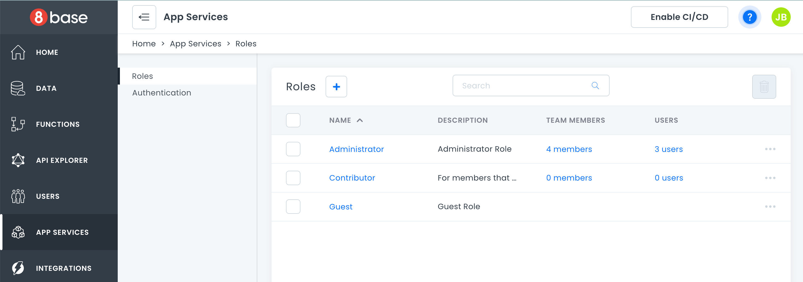

# App Services

The App Services dashboard is where you control your roles, permissions, and authentication types. 

Role-based security lets you define custom roles with granular access controls. You can specify which tables and fields a role can read, modify or delete. You can even apply custom filters, such as giving users access only to records they created.

Every 8base workspace initializes with native support for signing up, managing, and authorizing your application's users. This eliminates the need to manage emails and passwords or social sign-on providers without compromising on access to your user data.

