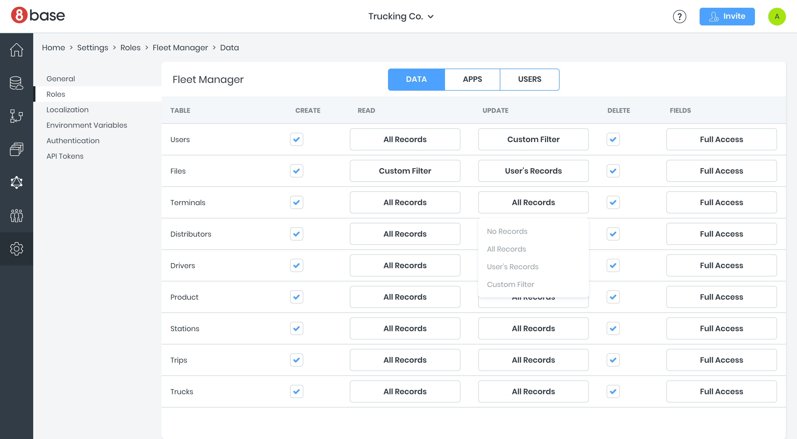

# App Services

Role-based security lets you define custom roles with granular access controls. You can specify which tables and fields a role can read, modify or delete. You can even apply custom filters, such as giving users access only to records they created.

