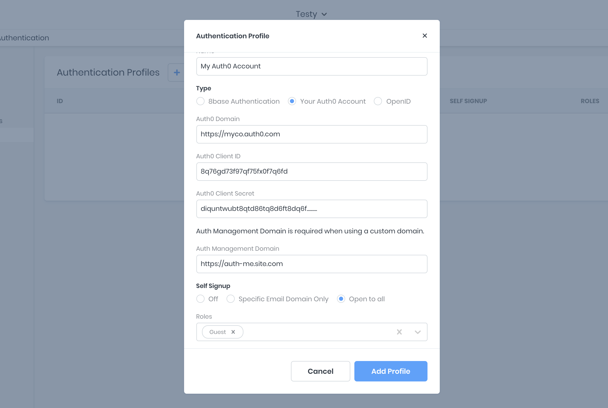

# Auth0 Integration

There are only a few steps required to set up your Auth0 account on 8base. First, navigate to the `App Services > Authentication` of your workspace and create a new _Authentication Profile_. In the form that appears, select _Your Auth0 Account_.

All required information is in the settings of your Auth0 account.

