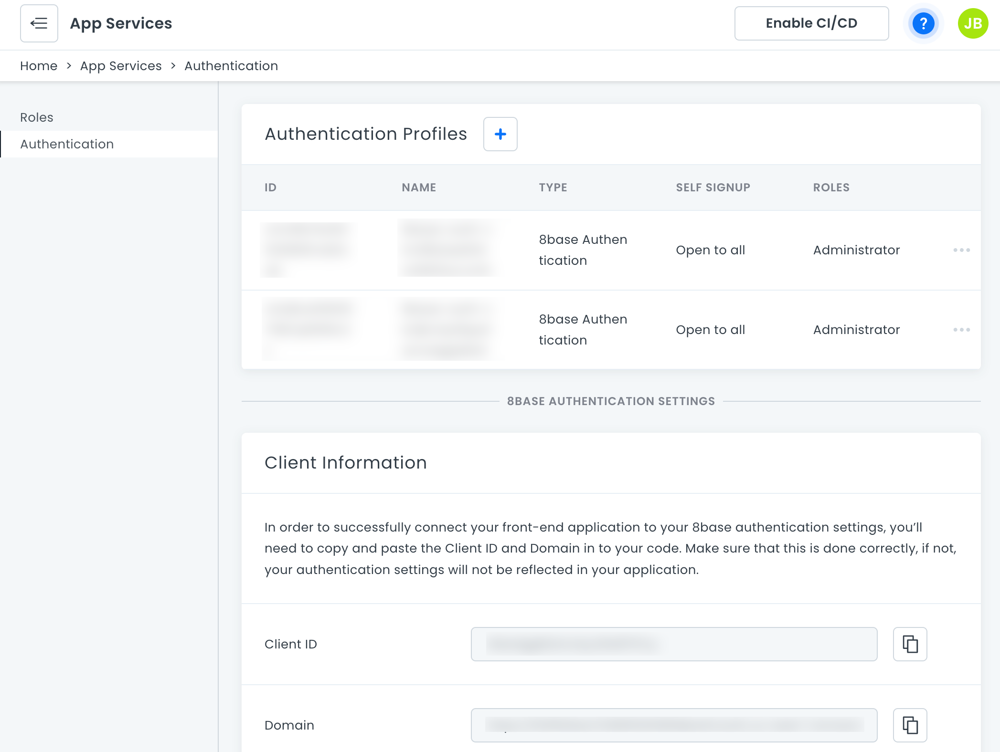
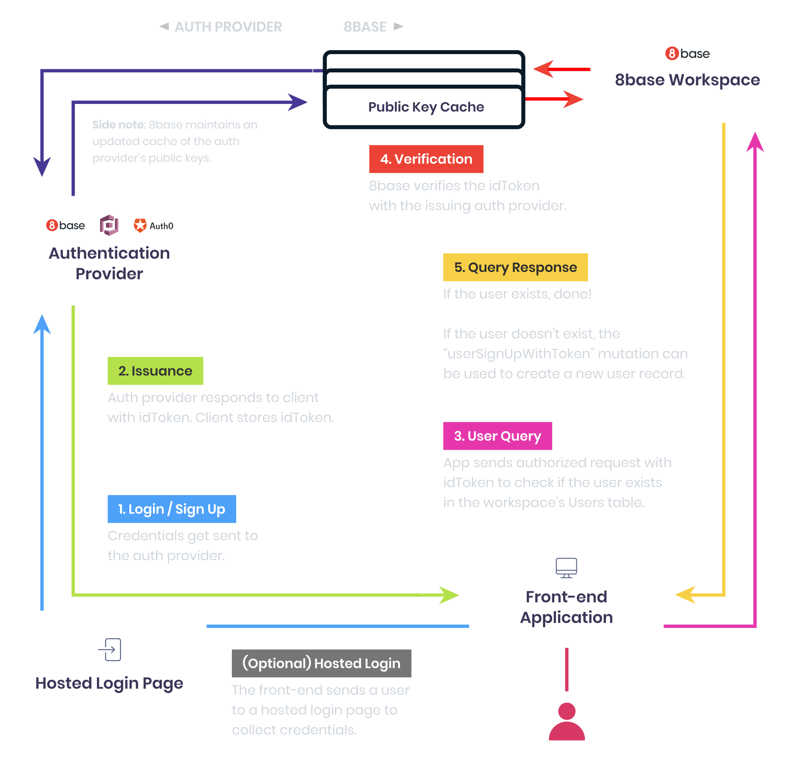

# Authentication

8base authentication is the default option for all workspaces. Upgraded workspace plans have the option to connect Auth0 accounts or an OpenID provider.

-   **[8base Authentication](authentication-8base.md)**: Running on AWS Cognito, this provides an integrated experience within 8base without additional services.
-   **[Auth0](authentication-auth0.md)**: If you have existing authentication schemes with Auth0, you can integrate it into your 8base backend.
-   **[OpenID](authentication-openID.md)**: For developers leveraging a compliant service to manage their users' authentication needs.



<!-- ## Understanding 

8base simplifies the process of setting up authentication: 

 -->

## Login / Signup

8base does **not** store or manage passwords. All login credentials are stored with an auth provider. This means that only an auth provider can login or register a user! Therefore, 8base allows you to use GraphQL mutations or a _Hosted Login Page_ to send a user's credentials to auth providers. However, it's the auth provider's system that will validate a user's credentials and identity.

## Issuance

When an auth provider authenticates a user, it issues an `idToken`. Think of the `idToken` as a temporary passport that contains information about the user that authenticated. This `idToken` get's returned to the front-end application. It can be stored and used to authenticate API requests made to an 8base workspace.

_To dive deeper into idTokens (JSON Web Tokens), please visit [https://jwt.io/](https://jwt.io/)_

## User Query

**Simply authenticating a user doesn't add them to a workspace's _Users_ table in 8base**. However, using the `idToken`, an authenticated request can be sent to the workspace API and check whether the token's user exists. To authenticate that request, the token only needs to be added as a _Bearer_ token in the authorization header.

For example, if you're using JavaScript `fetch` to handle the request, your script might look something like the following.

```javascript
fetch('8BASE_WORKSPACE_API_ENDPOINT', {
  method: 'POST',
  headers: {
    'Content-Type': 'application/json',
    Authorization: `Bearer ${idToken}`,
  },
  body: JSON.stringify({ query: '{ user { id } }' }),
})
  .then(userExistsCallback)
  .catch(userDoesntExistCallback);
```

## Verification

When 8base receives an authorized API request (a request containing an `idToken`) it validates that token with the issuing auth provider. 8base handles this step using data that's encoded in the `idToken`. This way, a fraudulent token is detected and discarded before any sensitive data is accessed.

## Validation

Once the auth provider validates that the `idToken` – and the user claiming the token – are authentic, it let's 8base know. 8base now can confidently extract the user's primary identifier from the token (for example, email address) and query an existing record in the _Users_ table.

## Query Response

If the query runs successfully and a user record is returned, great! Just ensure to continue sending the `idToken` in the authorization header on future API calls.

If the query **fails and a user record is not found**, we simply need to create a record for the new user. This can be accomplished using the [`userSignUpWithToken`](#mutation-usersignupwithtoken), as seen below.

```javascript
mutation {
  userSignUpWithToken(
    authProfileId: "8BASE_AUTHENTICATION_PROFILE_ID"
    /* if not specified - will be executed with the
    first auth profile in authenticationProfilesList */
    user: {
      email: "my@email.co"
	    // ...any other user data
    }
  ) {
    id
  }
}
```
## Troubleshooting

### 'Not Authorized' error

If you're unable to get the authentication provider to work and are receiving a `Not Authorized` error message, you may need to update the associated role and its API permissions. You can do this by first ensuring that the configured provider has an associated role, like _Guest_. Next, navigate to `App Services > Roles > [ROLE_NAME] > Data` and ensure that the role is enabled for the _Get Token_ function call.

### Mismatch between auth provider user pool and 8base Users table

Make sure you keep _Users_ table records in 8base up to date with records in your authentication provider user pool. Let's say you are using Custom Auth0 and have manually changed the email for some _User_ record in 8base. This will lead to an authentication error because the email (primary identifier) from the Auth0 token and email from the existing _User_ record are different.


