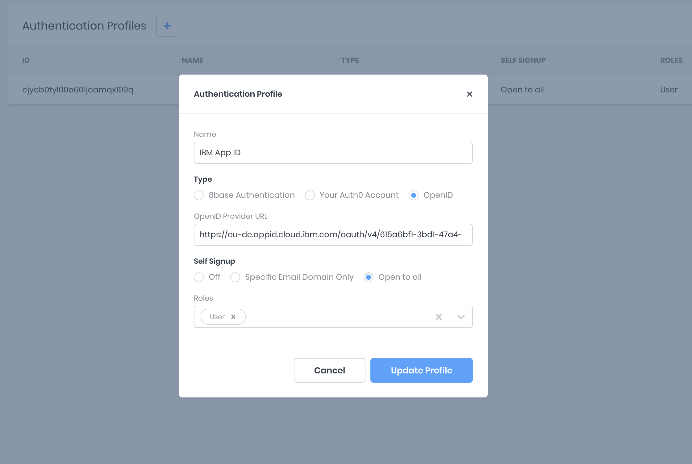

# OpenID

The ability to set up an authentication provider that supports the OpenID specification is available for workspaces with a paid plan.

In the 8base Management Console, you're able to configure one or more authentication providers under `App Services > Authentication`. Click the "+" button and fill out the provider form, select _OpenID_ as the type and add an OpenID Provider URL. Once completed, the record is saved to your _Authentication Profiles_.



## getToken Resolver

A custom _getToken_ resolver mutation function must be deployed to the workspace. This can be done by installing the [8base CLI](./development-tools/cli).

In the provided _getToken_ function, the relevant environment variables are accessed - if set in the Management Console - to provide the required credentials and configurations. A request is then made to the authentication provider to query or create the authenticating user from the database and return the user's token.

```yaml
functions:
  getToken:
    handler:
      code: src/getToken.ts
    type: resolver
    schema: src/getToken.graphql
```

```javascript
const { URLSearchParams } = require('url');
const fetch = require('node-fetch');
const gql = require('graphql-tag');
const jwtDecode = require('jwt-decode');

const APP_ID_CLIENT_ID = process.env.APP_ID_CLIENT_ID;
const APP_ID_TENANT_ID = process.env.APP_ID_TENANT_ID;
const APP_ID_SECRET = process.env.APP_ID_SECRET;
const APP_ID_URL = process.env.APP_ID_URL;
const TOKEN_PATH = '/token';

const CLIENT_REDIRECT_URI = process.env.CLIENT_REDIRECT_URI;

const CURRENT_USER_QUERY = gql`
  query CurrentUser {
    user {
      id
      email
    }
  }
`;

const USER_SIGN_UP_MUTATION = gql`
  mutation UserSignUp($user: UserCreateInput!, $authProfileId: ID) {
    userSignUpWithToken(user: $user, authProfileId: $authProfileId) {
      id
      email
    }
  }
`;

export default async (event: any, context: any) => {
  const body = new URLSearchParams();

  body.append('grant_type', 'authorization_code');
  body.append('code', event.data.code);
  body.append('client_id', APP_ID_CLIENT_ID);
  body.append('redirect_uri', CLIENT_REDIRECT_URI);

  let token;
  let email;

  try {
    let tokenResponse = await fetch(`${APP_ID_URL}${APP_ID_TENANT_ID}/${TOKEN_PATH}`, {
      body,
      headers: {
        'Authorization': 'Basic ' + Buffer.from(`${APP_ID_CLIENT_ID}:${APP_ID_SECRET}`).toString('base64'),
        'Content-Type': 'application/x-www-form-urlencoded'
        'Accept': 'application/json',
      },
      method: 'post',
    });

    ({ id_token: token } = await tokenResponse.json());

    try  {
      await context.api.gqlRequest(CURRENT_USER_QUERY, {}, {
        authorization: token,
      });
    } catch (e) {
      ({ email } = jwtDecode(token));

      await context.api.gqlRequest(USER_SIGN_UP_MUTATION, {
        user: {
          email,
        },
        authProfileId: event.data.authProfileId,
      }, {
        authorization: token,
      });
    }
  } catch (e) {
    console.log(e);
    throw Error('Authorization Error');
  }

  return {
    data: {
      token,
    },
  };
};
```

```javascript
type TokenResult {
  token: String!
}

extend type Mutation {
  getToken(code: String!, authProfileId: ID!): TokenResult
}

```

## Setting Environment Variables

To set environment variables that can be accessed from within custom functions, open up your workspace, and navigate to `Settings > Environment Variables`. Here, any key-value pair may be securely stored and accessed from within your functions at `process.env.<ENV_VARIABLE_KEYNAME>`.


