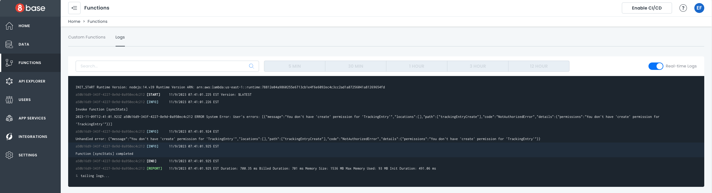

# Logs

You can see logs related to your custom functions on the **Logs** tab in the **Functions Dashboard**.

Logs can be watched and searched in real time, similar to a tailing function. Turn on the **Real-Time Logs** toggle on the top right. A dialog will appear telling you that a connection has been established.

:::note
There is a short latency period for real-time logs. Every request made is assigned a unique ID that can be used to search and identify a single request.
:::

If a `console.log('...something')` statement is used inside of a custom function, the printed result will appear here inside the logs.

## Remote Function Execution

In order to view logs from remote function execution use:

`8base logs [FUNCTION NAME]`.

The optional parameters `-n` and `-t` allow you to specify the number of lines returned, as well as continuously stream logs in your terminal (tail).
