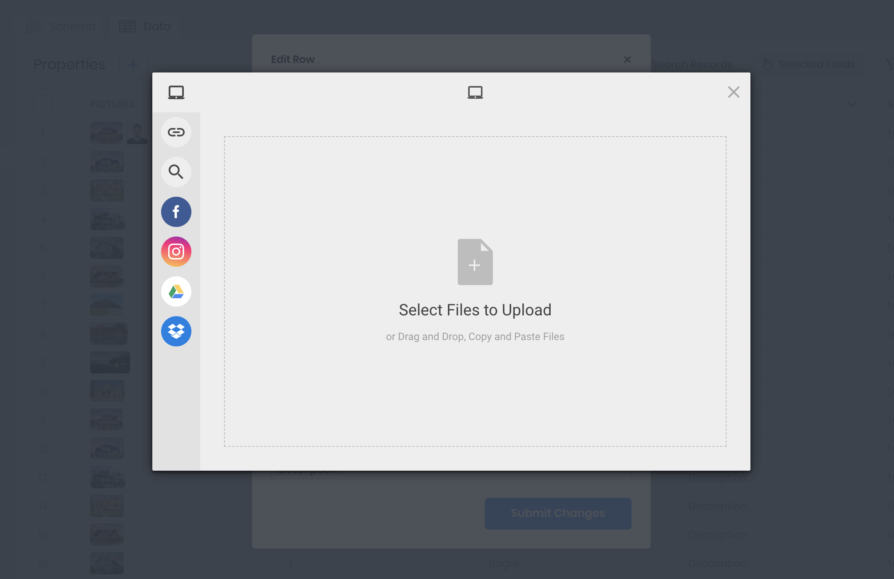
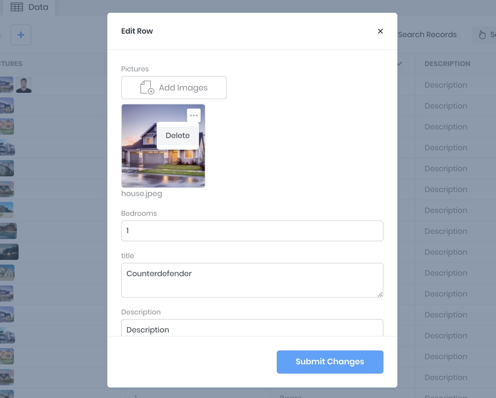

# Handling Files

In the 8base GraphQL API, `Files` is just another table that supports all standard CRUD operations and connections to other tables. When you create a field of type `File`, the platform creates a relationship (connection) between your table and the `Files` table under the hood. This allows you to use connection-related operations such as `create`, `connect`, `disconnect` on file-type fields.

[Filestack](https://www.filestack.com/) handles delivery and transformations on file uploads in the 8base Console. [S3](https://aws.amazon.com/s3/) is then used to safely store the uploaded file. This means you can easily manage files (pictures and documents) as they are attached to different records.

## Managing Files

### Upload

Inside the **Data Viewer** you can manage all records for the selected data table. When creating or editing a record, the `Add <File Type>` option will appear next to any pertaining data field. Using this option will launch the Filestack uploader, allowing you the option of uploading different files through a number of connected channels.

### Delete

In this same view, you are able to remove any file from a given record. Simply use the **...** drop-down located on the image and select **Delete**. Make sure to save your changes before leaving the screen.

