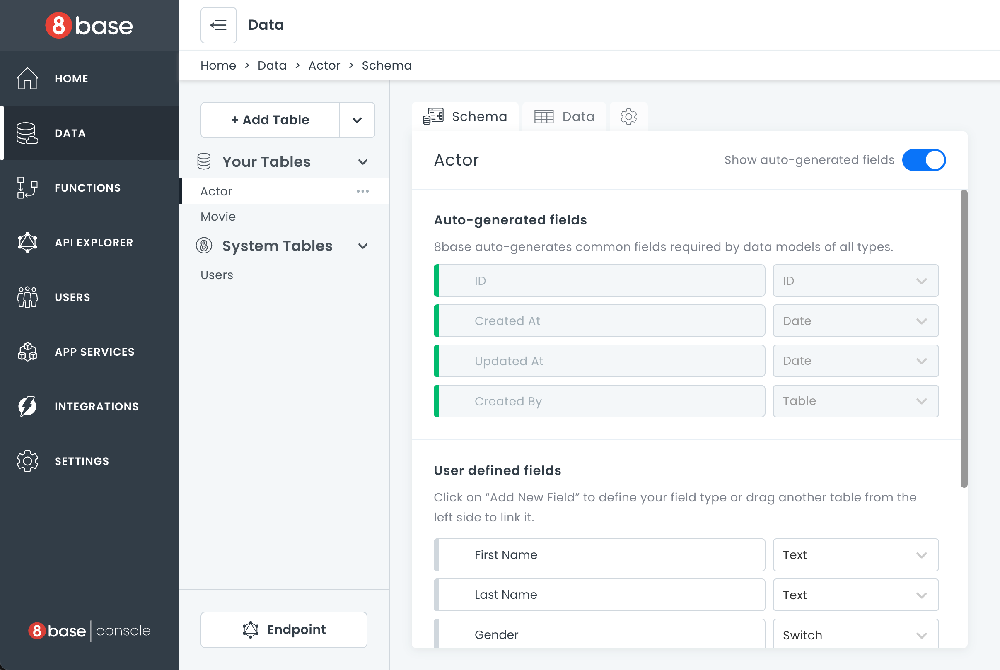
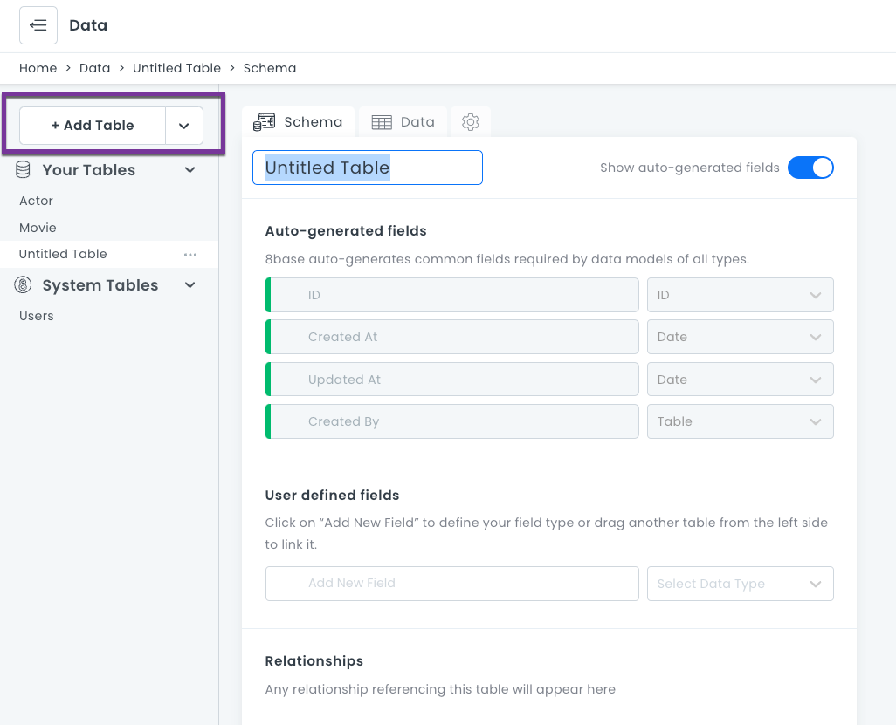
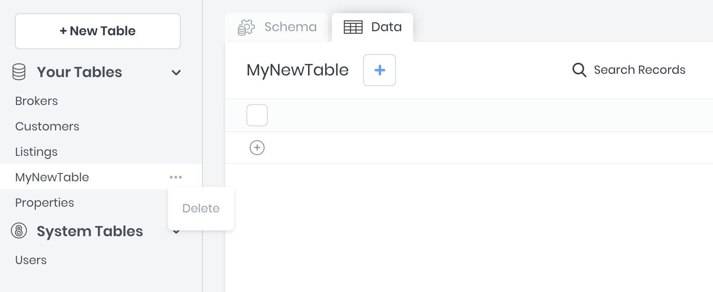

# Data Builder

The **8base Data Builder** is a data modeling interface for defining database tables, field types, and relationships between tables. The Data Builder is found in the 8base console's **Data** tab.

For each table defined, the 8base GraphQL engine creates GraphQL schema object types and the corresponding query, mutation, and subscription fields with resolvers automatically. 

This means that all Create, Read, Update, and Delete (CRUD) actions, as well as real-time connections (websockets) are immediately available to use via the workspace's unique API endpoint.

## Working with Tables

In the background, 8base spins up an Aurora MySQL database instance for your workspace. Aurora is a relational database that can handle complex queries and is ACID (Atomicity, Consistency, Isolation, Durability) compliant. When tables are created, updated, and deleted in a workspace, 8base handles the corresponding migrations and executes them immediately against the database. Therefore, you're database is always reflected by the Data Builder UI - showing all available fields, validations, tables, and relations.

### Creating Tables

Click the **+ Add Table** button to create a new table. The default name for new tables is "Untitled Table". All tables require unique names (`attribute`, `workspace` names and their plural form are reserved and cannot be used in any letter cases).

As soon as a table is created, corresponding GraphQL schema types and query, mutation, and subscription resolvers will be generated automatically.

### Updating Tables

After a table is created, fields and relations can be defined. All updates to a table are published in real-time, giving a seamless experience between defining a data model and having it be highly available.

As soon as a table is updated, its corresponding GraphQL schema types and query, mutation, and subscription resolvers will be updated automatically.

To ensure that table related errors and mistakes are minimized, 8base protects against many harmful actions. Some of these include:

- A prompt that requires a _Default Value_ will appear when changing a **non-mandatory** field to **mandatory**.
- Date, Number, and Text field values are automatically converted when an existing field _type_ is updated.
- When changing a **non-unique** field to **unique**, current records are validated for having unique values.

### Deleting Tables

To delete a table:
1. Go to the table name and click **...**. 
2. Click **Delete**.
3. A confirmation dialog opens. Type in the table name and click **Delete**.
:::warning
Deleted tables **cannot** be restored and any existing table records will be lost. Additionally, if there are tables that are related to the table being deleted - _belongs to_ and _has many_, either specified as mandatory or not - those relations will be severed.
:::

## Table Relationships

8base supports three types of table relationships to be defined that are congruent with what to expect from relational databases:

| Type           | _A_ to _B_                                                           | _B_ to _A_                                                           |
| -------------- | -------------------------------------------------------------------- | -------------------------------------------------------------------- |
| `one-to-one`   | Records in table A may `have_one` or `belong_to` records in table B. | Records in table B may `have_one` or `belong_to` records in table A. |
| `one-to-many`  | Record in table A may `have_many` records in table B.                | Records in table B may `have_one` or `belong_to` records in table A. |
| `many-to-many` | Record in table A may `have_many` records in table B.                | Record in table B may `have_many` records in table A.                |

Defining a relationship between two tables can be accomplished by dragging and dropping one table onto another or by selecting `Table` as the Data Type when creating a new table field.

### Table Configurations

For specifying _has many_, _has one_ and _belongs to_ relationships between tables.

Configurations

- **Table**: For selecting what table is to be related.
- **Relation Field Name**: The name of the relation as it appears on the **corresponding** table.
- **Allow Multiple X to Y**: Whether the relationship is _has one_ or _has many_.
- **Mandatory**: Whether the field relationship is required.
- **Description**: An optional text box where you can write information about the field.

### Self-Referential Relationships

Self-Referential relationships can be defined by relating tables to themselves! For example, a the _Users_ table might have a `many-to-many` relationship with itself, and use a named association of _friends_.

## Table Types

There are three table types: Custom, System, and View.

### Custom Tables

Custom tables are the tables created in any workspace by an administrator. They are fully customizable.

### System Tables

System tables are tables that come automatically with a workspace. For example, the  _Users_ table. They are fully extensible, meaning that new fields and relations can be added to them. However, these tables cannot be deleted or renamed. Their default fields cannot be changed.

### View Tables

View Tables are virtual tables that aggregate fields from several tables into a single _view_. Under the hood, they are based on the result-set of an SQL statement. In a workspace, they can be created using the `viewCreate` GraphQL mutation in the API Explorer.

For more information on views, see [SQL Views](https://www.w3schools.com/sql/sql_view.asp).

Salesforce data can be imported as View Tables. For more information, see [Salesforce](../8base-console-plugins-integrations-salesforce.md).
