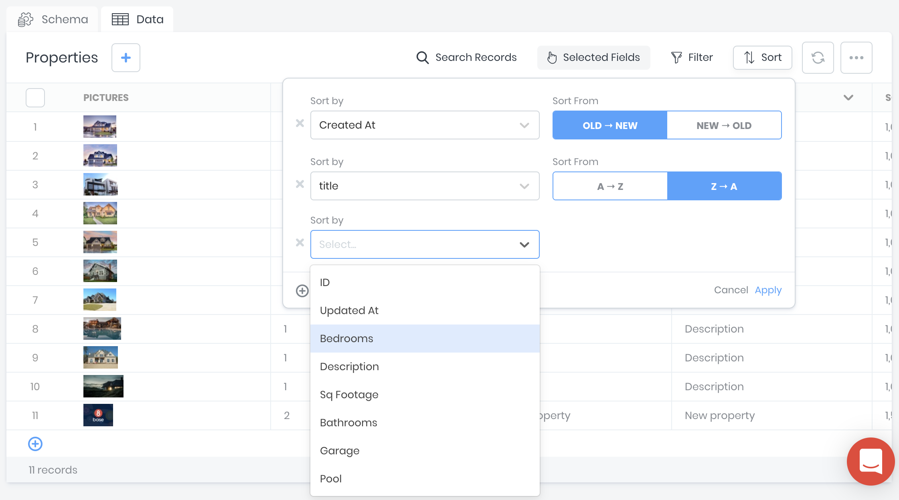

# Data Viewer

 The **8base Data Viewer** lets you search and manage table records. You can sort, filter, and search your tables. You can also edit table rows and import data from CSV files. 
 
 If you are viewing a schema, click the **Data** tab to see the **Data Viewer**. 

## Adding Records

To create a new table record: 

1. Click the **+** button next to the table name. 
2. A form will appear that displays all table fields.

3. Fill in the fields and click **Add Row**.

:::note
All validations specified in the schema definition are enforced while using the Data Viewer. For example, if you have set a field to always have unique values, you will see a warning if you try to create or edit a record where this field has a duplicate value.
:::

## Editing Records

To edit records:

1. Click the checkbox next to the record. Click the pencil icon.

2. A dialog box opens. Update the fields and click **Submit Changes**.

## Deleting Records

To delete records:

1. Select the records you want to delete.
2. Click the **...** menu.
3. Click **Delete selected records**.

4. A dialog box opens. Click **Delete**.
:::warning
This action cannot be undone.
:::

## Filtering Records

You can apply filters to reduce the number of records displayed. Multiple filters can be added and used together. 

## Sorting Records

Data records can be sorted using one or more attributes. Sort attributes are ranked in the order in which they were created. Additionally, filters can be applied to reduce the number of records displayed. Multiple filters can be added and used together. 

## Selected Fields

You can customize which field columns display in the Data Viewer. Click on the `[Selected Fields]` drop-down and toggle on/off desired fields. You can also choose to show all or hide all.

In the same drop-down, columns can be reordered. Simply drag items in the drop-down to any preferred order.

:::note
By default, the _createdAt_, and _updatedAt_ field columns are hidden in the Data Viewer. 
:::

## Advanced Sorting and Filtering

The Data Viewer's filtering and sorting UI does not support filtering based on related tables.

You can use the [API Explorer](../8base-console-platform-tools-api-explorer.md) for advanced table filtering and sorting.