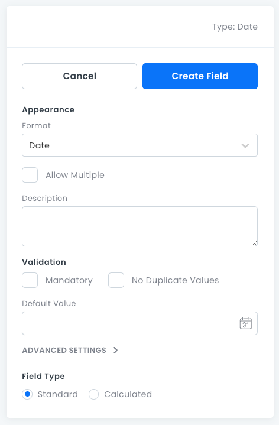

# Date Fields

For storing _Date_ and _DateTime_ data.

## Date Field Properties

- **Format**: Whether the field stores a _Date_ or a _DateTime_ value.
- **Allow Multiple**: Stores 0 or more _Date_ values in an array (not searchable).
- **Description**: An optional text box where you can write information about the field.
- **Mandatory**: Whether this field must have a value.
- **No Duplicate Values**: Whether the field value is required to be unique.
- **Default Value**: The default value assigned to new records.
- **Advanced Settings**:
  - **Field Type**: Standard or Calculated. For more information, see [Advanced Field Settings](data-fields-advanced-settings.md).

