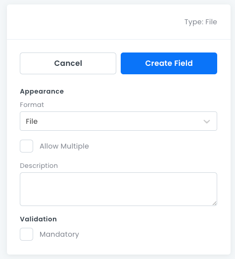

# File Fields

For storing _Image_ and _File_ objects. For example, user avatar images.

File field properties:

- **Format**: Whether the field stores a _File_ or an _Image_.
- **Allow Multiple**: Stores 0 or more _File_ objects in an array.
- **Description**: An optional text box where you can write information about the field.
- **Mandatory**: Whether this field must have a value.

