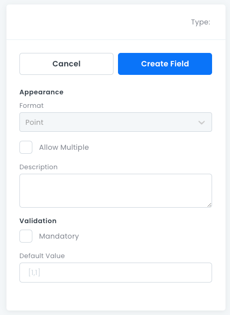

# Geo Fields

For storing _geo_ data points, based on latitude and longitude.

## GEO Field Properties

- **Format**: Must be set to _Point_.
- **Allow Multiple**: Stores 0 or more _Smart_ objects in an array.
- **Description**: An optional text box where you can write information about the field.
- **Mandatory**: Whether this field must have a value.
- **Default Value**: The default value assigned to new records.

