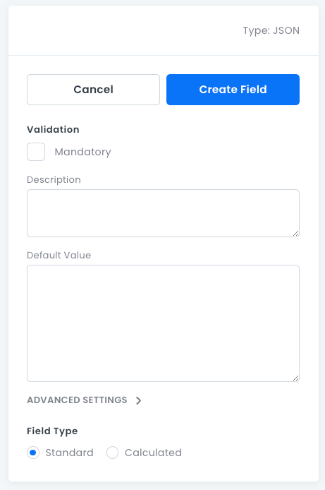

# JSON Fields

For storing _JSON_ objects.

## JSON Field Properties

- **Mandatory**: Whether this field must have a value.
- **Description**: An optional text box where you can write information about the field.
- **Default Value**: The default value assigned to new records.
- **Advanced Settings**:
  - **Field Type**: Standard or Calculated. For more information, see [Advanced Field Settings](data-fields-advanced-settings.md).

