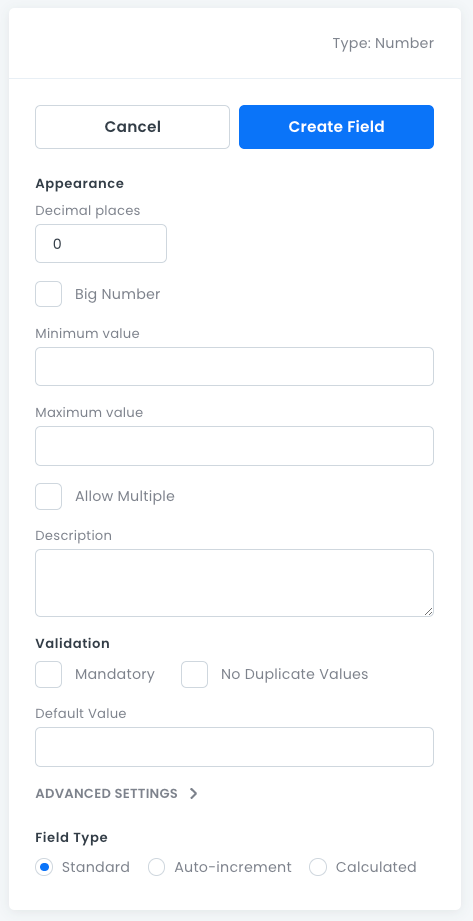

# Number Fields

For storing _Integer_, _BigInt_, and _Float_ data.

## Number Field Properties

- **Decimal Place**: How many decimal places _Float_ values maintain.
- **Big Number**: For numbers outside the range `-2^63 (-9,223,372,036,854,775,808) to 2^63-1 (9,223,372,036,854,775,807)`
- **Minimum Value**: The minimum value required.
- **Maximum Value**: The maximum value required.
- **Allow Multiple**: Stores 0 or more _Number_ values in an array (not searchable).
- **Description**: An optional text box where you can write information about the field.
- **Mandatory**: Whether this field must have a value.
- **No Duplicate Values**: Whether the field value is required to be unique.
- **Default Value**: The default value assigned to new records.
- **Advanced Settings**:
  - **Field Type**: Standard, Auto-increment, or Calculated. For more information, see [Advanced Field Settings](data-fields-advanced-settings.md).

