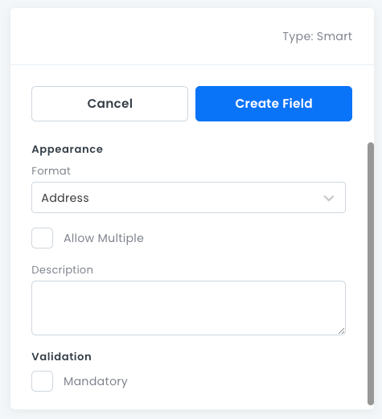

# Smart Fields

For storing _addresses_ and _phone numbers_ with managed validations and logic.

Smart fields are enriched field types offered by 8base. They provide structure, and sometimes logic, to the organization and validation of common data.

## Smart Field Properties
- **Format**: Whether the field stores a _Phone Number_ or an _Address_.
- **Allow Multiple**: Stores 0 or more _Smart_ objects in an array.
- **Description**: An optional text box where you can write information about the field.
- **Mandatory**: Whether this field must have a value.



## Address

For persisting addresses in a field. The `address` field will display available fields in the [Data Viewer](/projects/backend/data/data-viewer) and API Explorer.

```ts
type Address = {
  country: !String;
  street1: !String;
  street2: String;
  zip: !String;
  city: !String;
  state: !String;
};
```

## Phone

For persisting phone numbers in a field. The `phone` field will display available fields in the [Data Viewer](/projects/backend/data/data-viewer) and API Explorer.

```ts
type Phone = {
  code: !String;
  number: !String;
};
```