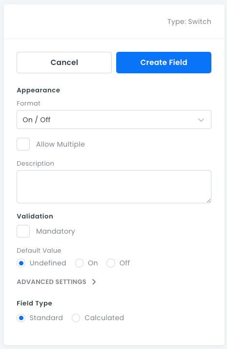

# Switch Fields

For storing _Boolean_ and custom _Enum_ type data. Data where there are only two options, such as true or false, yes or no.

## Switch Field Properties

- **Format**: For specifying the _Boolean_ type, such as true or false.
- **Allow Multiple**: Stores 0 or more _Boolean_ values in an array (not searchable).
- **Description**: An optional text box where you can write information about the field.
- **Mandatory**: Whether this field must have a value.
- **Default Value**: The default value assigned to new records.
- **Advanced Settings**:
  - **Field Type**: Standard or Calculated. For more information, see [Advanced Field Settings](data-fields-advanced-settings.md).

