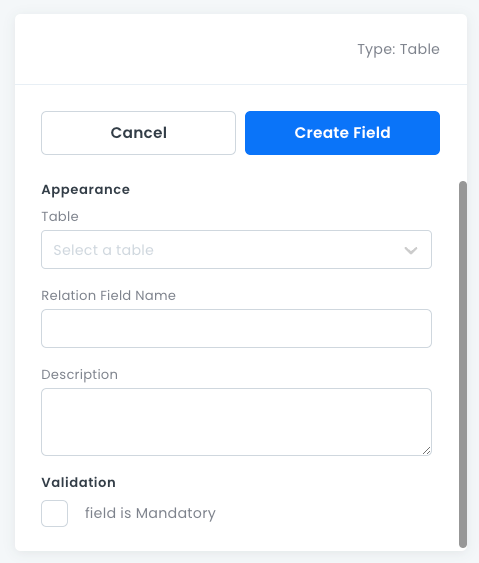

# Table Fields

For specifying _has many_, _has one_ and _belongs to_ relationships between tables.

## Table Field Properties

- **Table**: For selecting what table is to get related.
- **Relation Field Name**: The name of the relation as it appears on the **corresponding** table.
- **Description**: An optional text box where you can write information about the field.
- **Allow Multiple X to Y**: Whether the relationship is _has one_ or _has many_.
- **Mandatory**: Whether the field relationship is required.

