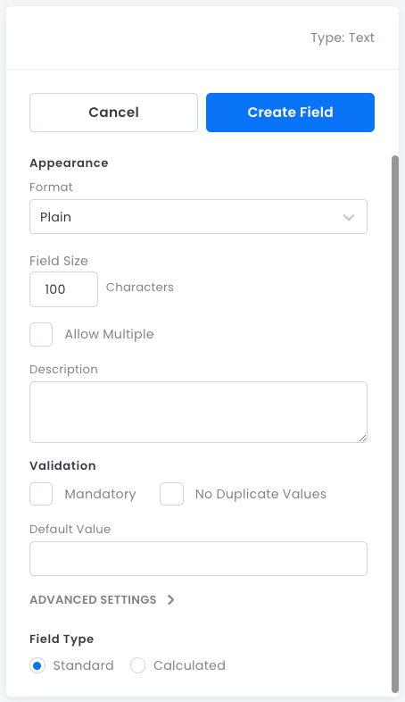

# Text Fields

Text fields are for storing _String_ data. For example: customer names, regions, and email addresses.

## Text Field Properties

- **Format**: For specifying what values the field stores (_Plain_, _HTML_ or _Markdown_).
- **Field Size**: The maximum string length, in characters.
- **Allow Multiple**: Stores 0 or more _Text_ values in an array (not searchable).
- **Description**: An optional text box where you can write information about the field.
- **Mandatory**: Whether this field must have a value.
- **No Duplicate Values**: Whether the field value is required to be unique.
- **Default Value**: The default value assigned to new records.
- **Advanced Settings**:
  - **Field Type**: Standard or Calculated. For more information, see [Advanced Field Settings](data-fields-advanced-settings.md).

