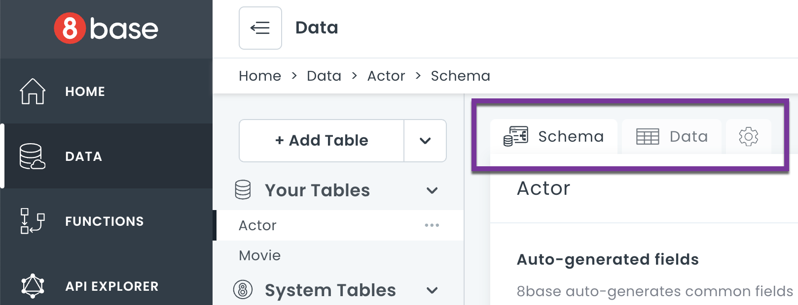

# Data

The **Data** section of the 8base Console is the interface where you design, configure, and manage your database.

The [**Data Builder**](8base-console-platform-tools-data-builder.md) is a visual database schema designer. You can access it on the **Schema** tab. This is where you can add or remove fields, and set data validation.

The [**Data Viewer**](8base-console-platform-tools-data-viewer.md) is a spreadsheet-like data view and management interface. You can access it on the **Data** tab. You can create and edit table records, and sort table data. You can also import data from CSV files.

Under **Settings** you can change the name of a data table and create an index. You can access settings on the tab with the gear icon.

