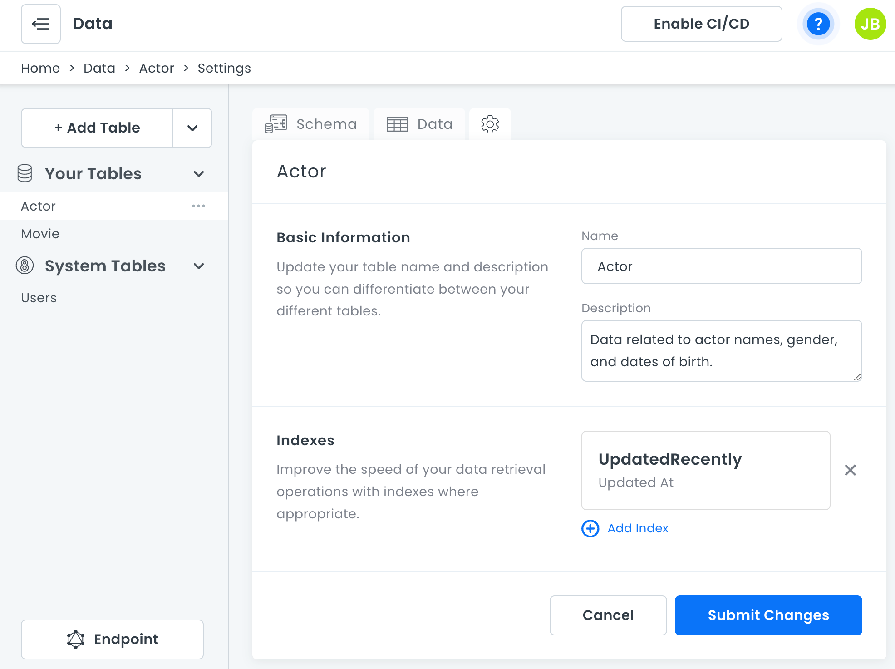

# Data Settings

You can change the name and description of tables in the 8base console. You can also create [Table Indexes](data-table-indexes.md), which can improve the speed of your data retrieval operations.

To open table settings, click **Data** in the sidebar, select the table you want to work on, and then click the  tab.

After you edit the name or description, remember to click **Sumbit Changes**.