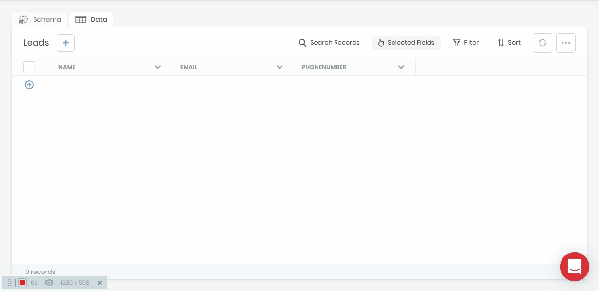

# Importing Data

Data can be imported from CSV files in the Data Builder and Data Viewer. 

In the Data Viewer, click the **...** button in the top right corner of the menu bar and choose **[Import CSV]** from the drop-down. The CSV importer supports column mapping and enforces all schema defined validations on create.

Please refer to the [CLI's Import](/projects/backend/development-tools/cli/commands#import) command docs to import more complex data, such as related records, images, smart fields, etc.

