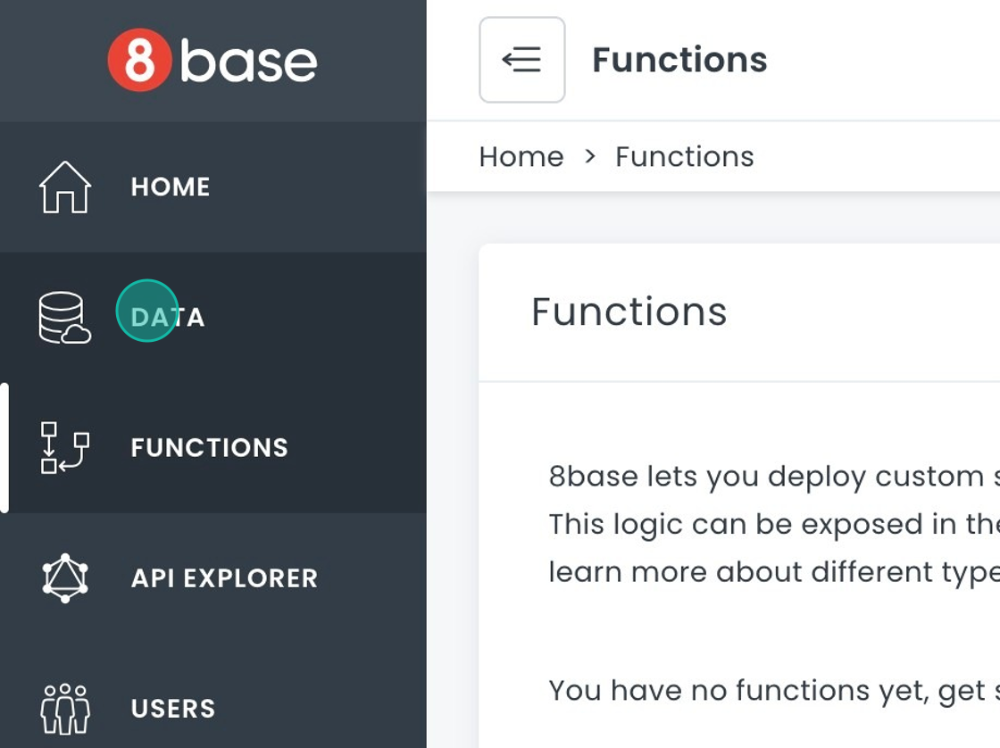
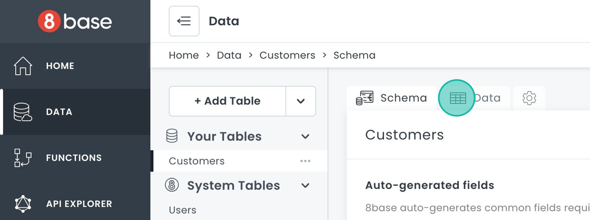
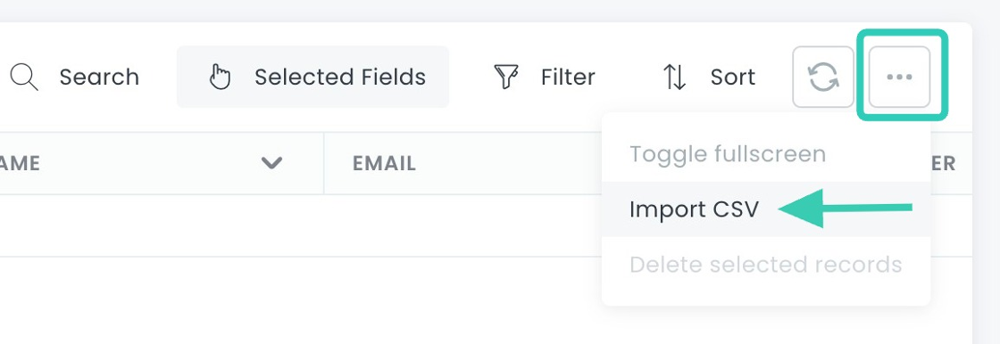
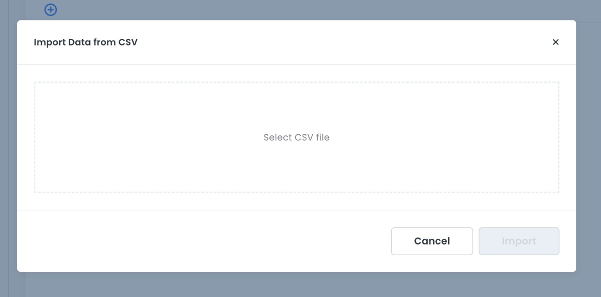
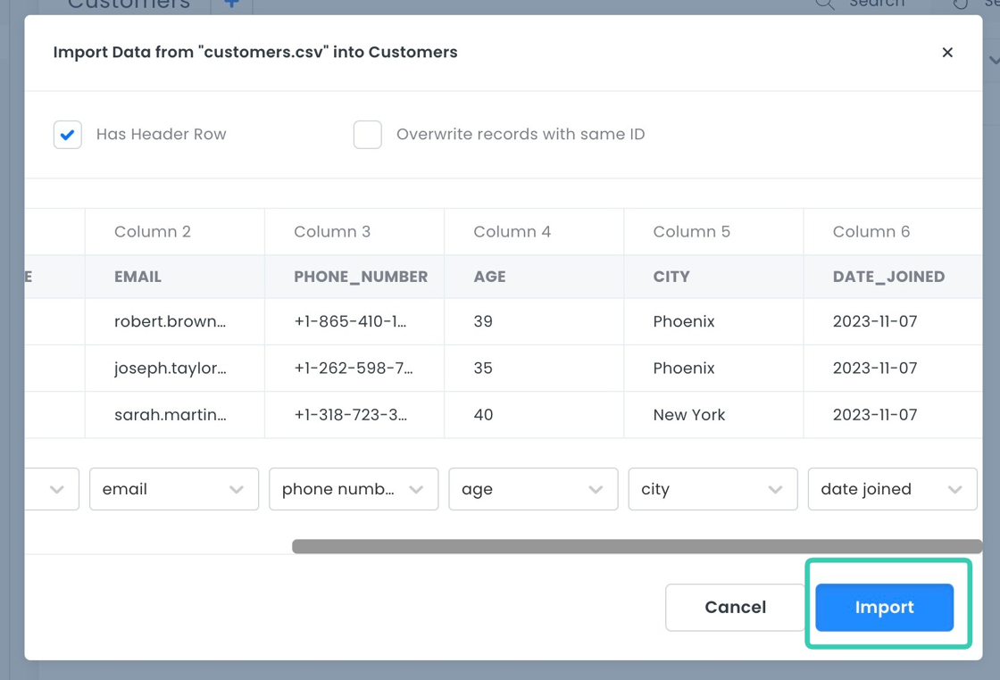

# Importing Data

Data can be imported from CSV files in the Data Viewer. 

## Data Validation

The CSV importer supports column mapping and enforces all schema defined validations. For example, if you have set a field to always have unique values, you cannot import records where this field has a duplicate value.

## Importing Data from CSV Files

You can download this CSV file to test this example: [Sample CSV file](_files/customers.csv).

1. In the sidebar, click **Data**.

2. Select the table where you want to import data, or create a new table.
3. Click the  Data tab. 

4. Click the **...** button in the top right corner of the toolbar. 
5. Choose **Import CSV** from the dropdown menu.
 
6. A dialog box will open. Click **Select CSV file** and choose your file.

7. Select whether your table has header rows and whether it should overwrite records with the same ID. Click **Import**.

8. When you are done, click **Close**.

## Importing Complex Data

Please refer to the [CLI's Import](../development-tools-cli-commands.md#import) command docs to import more complex data, such as related records, images, smart fields, etc.

