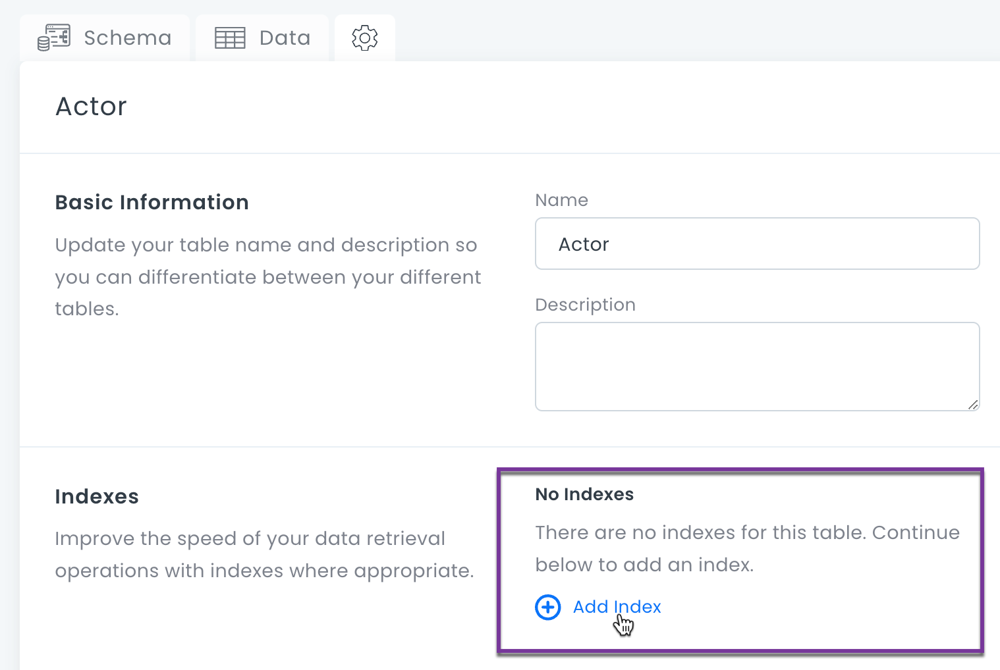
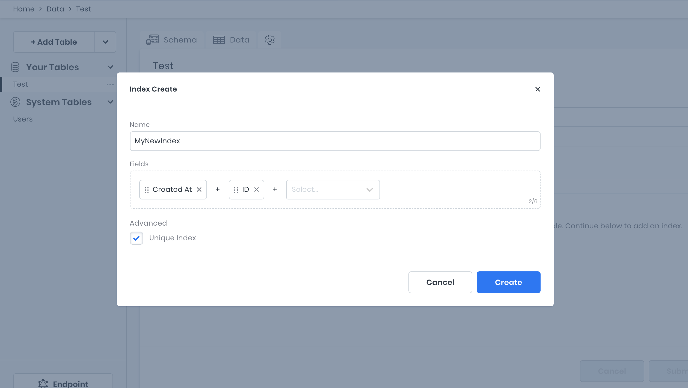

# Table Indexes

Adding one or more indexes to a table will improve data retrieval performance. Indexes are used to find rows with specific column values quickly. Without an index, the search must begin with the first row and then read through the entire table to find the relevant rows.

Indexes in 8base are based on MySQL. To learn more, see [How MySQL Uses Indexes](https://dev.mysql.com/doc/refman/8.0/en/mysql-indexes.html).

### Creating an Index

To create an index, select a table and click the gear icon. Then click the **Add Index** button.

You can select one or several fields in the table by which the index will be generated. You can also choose whether or not it will be a _Unique Index_. Index names cannot cannot contain spaces. When you are done, click **Create**.

