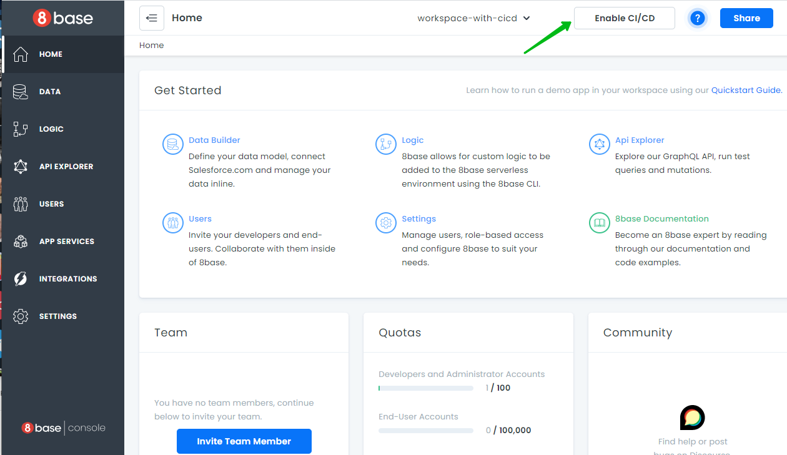
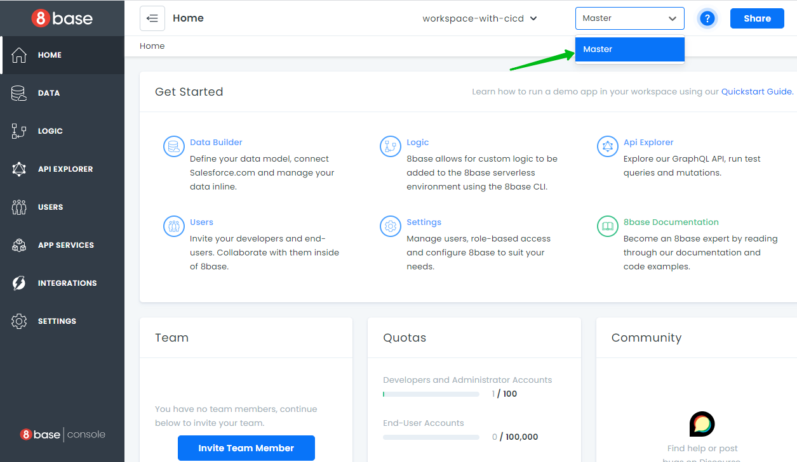

# CI/CD System

Teams that have multiple developers working simultaneously on different features of the same application – or Workspace – benefit from having isolated development environments for each developer. 8base implimented the СI/CD system implemented to make this possible!

By enabling CI/CD in your Workspace you can create additional Workspace **Environments**.



Only **Master Environment** is available by default.



The process of creating new Environments (cloning one Environment into another) is called **Branching**. Every Environment gets a unique URL/API endpoint that has the following anatomy `https://app.8base.com/<workspace_id>_<environment_name>`. There is no need to add `<environment_name>` to your URL for requesting _Master_ Environment.

### Environment rules

1. Environments are inheritable.
2. You CANNOT manually change _System Parts_ of parent Environments after Branching (for example, one Environment can’t be manually changed after another is created from it).
3. You CAN manually change _System Parts_ and deploy in child Environments (inheritors).
4. Every Environment can have up to 3-inheritors.

Changing/deploying to parent Environments is only possible with [Migration logic](/projects/backend/development-tools/cli/ci-cd#migrations-logic-and-commands).

You can read more about System Parts and User Parts of 8base in our [overview section](getting-started-readme.md).

## CI/CD Commands

The CI/CD System is controlled using the 8base CLI. There are 3 command categories that correspond to the main components of the CI/CD System; _Environment commands_, _Migrations commands_, and _Backup commands_.

### Environment Commands

Environment commands.

##### 1. environment branch

```sh
8base environment branch

# DESCRIPTION
#   Create new branch from current environment.

# OPTIONS
#   --debug, -d Turn on debug logs [boolean]
#   --help, -h Show help [boolean]
#   --name, -n Name of new environment [string][required]
#   --mode, -m The deploy mode [string][choices: "full", "system"] [default: "FULL"]
```

Using example:

```
# Branch new environment with `<env_name>` from currently set environment in one of the two modes.

8base environment branch -n <env_name> -m FULL/SYSTEM
```

Two modes of environment branching are available:

1. **SYSTEM Mode**: When branching in SYSTEM mode, only System Part of the Environment get cloned.
2. **FULL Mode**: When branching in FULL mode, both System and User Parts of the Environment get cloned.

##### 2. environment set

This command selects and sets the current working environment.

```sh
8base environment set

# DESCRIPTION
#   Set the current environment in your terminal.

# OPTIONS
#   --debug, -d Turn on debug logs [boolean]
#   --help, -h Show help [boolean]
#   --environmentName, -n The environment name of the project [string]
```

##### 3. environment show

Displays currently set environment.

```sh
8base environment show

# DESCRIPTION
#   Display current environment.

# OPTIONS
#   --debug, -d Turn on debug logs [boolean]
#   --help, -h Show help [boolean]
```

##### 4. environment delete

Deletes a named environment.

```sh
8base environment delete

# DESCRIPTION
#   Delete a workspace environment.

# OPTIONS
#   --debug, -d Turn on debug logs [boolean]
#   --help, -h Show help [boolean]
#   --name, -n Name of deleted environment [string][required]
```

##### 5. environment list

Displays all environments in the current workspace.

```sh
8base environment list

# DESCRIPTION
#   List all of your workspace environments.

# OPTIONS
#   --debug, -d Turn on debug logs [boolean]
#   --help, -h Show help [boolean]
```

### Migrations Logic and Commands

Making changes and deploying to parent Environments is only possible with **Migration logic**.

Basically, _Migrations_ are the files in the ‘migrations’ directory of your local project (`../<localProjectName>/migrations/`) which describe all the changes in Schema and/or System/User Data.

##### Migration file structure

Migration file naming pattern: `<time>-<data/<application-part>-<post-fix>.ts`

Migration file script:

```sh
import { Context, MigrationVersion } from "./typing.v1";
export const version: MigrationVersion = "v1";
export const up = async (context: Context) => {};
```

`Context` consists of methods for Schema/Data changing and a method for executing GraphQL requests.

The `up` function and `version` variable (`v1` for the version one of migration version) must be defined in every migration. There is a `CiCdMigrations` table that contains all of the already committed migration's in every Workspace environment.

### Commands for migration workflow

##### 1. migration generate

```
# Generates new migration files in your local `migrations` project directory.

migration generate
```

These migrations are automatically generated by the server after changes are made in a set Environment (for example - a new table is added). Developers can also manually create their own migration files and commit them directly to specified environments.

Generating migrations for data in the User's tables occurs differently. For User data, you must specify a _table name_ flag in command argument. For example:
`migration generate -t <tableName>` Note that this kind of migration returns the whole state of the requested table's records without any comparison to the target Environment.

```sh
8base migration generate

# DESCRIPTION
#   Get committed migrations.

# OPTIONS
#   --debug, -d Turn on debug logs [boolean]
#   --help, -h Show help [boolean]
#   --dist The folder of migrations [string][default: "./migrations"]
#   --tables, -t Specify table names to generate migrations for data. [array]
#   --environment, -e Target environment [string]
```

##### 2. migration status

This command shows the difference between your local migration files and any migrations committed to target Environment (migrations of `CiCdMigrations` table). You can check migrations to be committed with `migration status` and easily delete any you don’t need/want in your Schema/Data.

```sh
8base migration status

# DESCRIPTION
#   Display migration status.

# OPTIONS
#   --debug, -d Turn on debug logs [boolean]
#   --help, -h Show help [boolean]
#   --environment, -e Target environment [string]
```

##### 3. migration commit

Applies local migrations files to target Environment.

It is important to know that _[Custom Logic (Functions)](/projects/backend/custom-functions)_ are being deployed by default with any migrations files after `migration commit` is run. You can change this default behavior by specifying a commit mode:

- `--mode FULL` - commits migration files AND Custom Logic (Functions)
- `--mode ONLY_MIGRATIONS` - commits only migration (without Custom Logic)
- `--mode ONLY_PROJECT` - commits only Custom Logic (without migration files)

```sh
8base migration commit

# DESCRIPTION
#   Deploys migration in the 'migrations' directory to 8base. To use this command, you must be in the root directory of your 8base
#   project.

# OPTIONS
#   --debug, -d Turn on debug logs [boolean]
#   --help, -h Show help [boolean]
#   --mode, -m Commit mode. [string][choices: "FULL", "ONLY_MIGRATIONS", "ONLY_PROJECT"] [default: "FULL"]
#   --force, -f You can specify force flag to commit to master without prompt.
#   --environment, -e Specify the environment you want to commit. [string]
```

### Backups Commands

There is also a server feature for making backups (snapshots) of Environments in order to restore the Environment to a previous state.

##### 1. backup create

Create a whole backup of current environment. A backup (snapshot) contains full state of the Environment ([System](/projects/backend/getting-started#system-parts) and [User](/projects/backend/getting-started#user-parts) Parts).

```sh
8base backup create

# DESCRIPTION
#   Create a new backup of the environment.

# OPTIONS
#   --debug, -d Turn on debug logs [boolean]
#   --help, -h Show help [boolean]
```

##### 2. backup list

Show available backups for the current environment.

```sh
8base backup list

# DESCRIPTION
#   List all backups for environment.

# OPTIONS
#   --debug, -d Turn on debug logs [boolean]
#   --help, -h Show help [boolean]
```

##### 3. backup restore

Return the state of a current or specified environment to a specified backup. _It is recommended to execute ‘migration commit’ command before backuping of Environment._

```sh
8base backup restore [OPTIONS].

# DESCRIPTION
#   Restore environment to backup.

# OPTIONS
#   --debug, -d Turn on debug logs [boolean]
#   --help, -h Show help [boolean]
#   --backup, -b The name of the target backup [string][required]
#   --environment, -e Target environment name [string][required]
```

## Basic CI/CD Workflow

A basic CI/CD workflow can resemble something like this:

### Environments

- `Master` - gets used as the "Production" environment (live application backend).
- `Staging` environment gets branched from `Master` (pre go-live backend for testing).
- `Dev` environment gets branched from `Staging` (development backend for whole team).
- `<feature>-Branches` get branched from Dev for single developer or team working on isolated feature.

### Feature Development Workflow

1. Developer branches `dev_task_1` from `Dev` environment.
2. Developer executes `8base environment set -n dev_task_1` to switch the new environment.
3. Developer makes changes in the `dev-task_1` environment (for example, new functions).
4. Developer executes `8base migration generate` command (gets migration files for System Data update), reviews generated migration files and makes changes if necessary.
5. Developer switches environment to parent one (`Dev`) by executing `8base environment set -n Dev`
6. Developer checks the difference between `Dev` and his personal feature environment `dev_task_1` by executing `8base migration status -e dev_task_1` and makes sure only needed migrations will get committed.
7. Developer creates backup of the `Dev` snapshot.
8. Developer commits local migrations (and/or _Custom Logic_) by executing `8base migration commit -e Dev -m <commit-mode>`.
