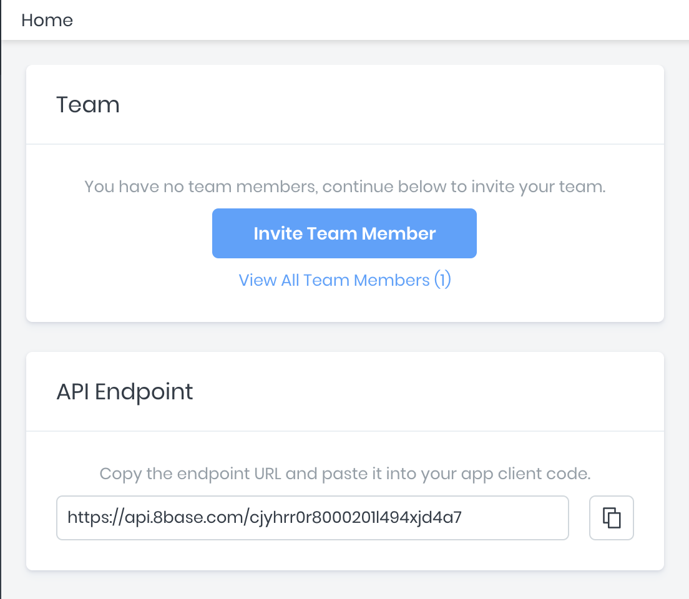
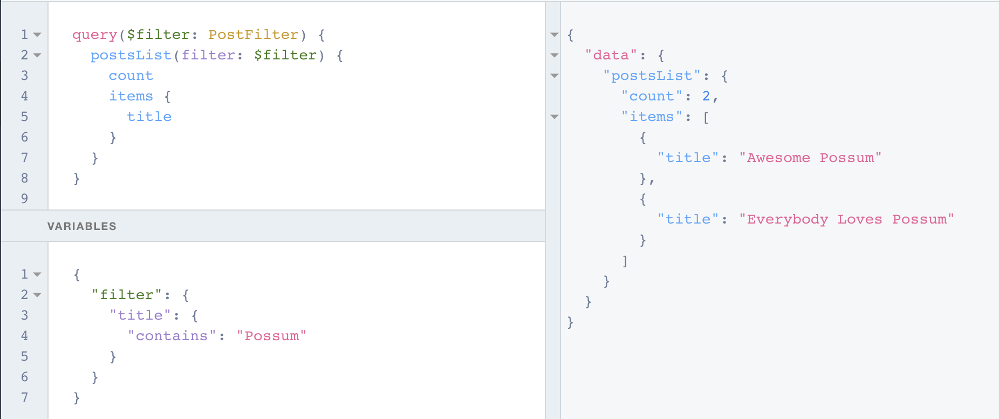

# GraphQL API Overview

Every workspace in 8base is assigned a unique API endpoint. These endpoints handle GraphQL queries, mutations, and subscriptions for every data table. The API comes pre-configured with filtering, pagination, full-text search, and other advanced features.

All API Endpoints are structured like this:
`https://api.8base.com/<WORKSPACE_ID>`

:::info 
You can extend these GraphQL resources with [Custom Functions](/backend/custom-functions).
:::

There are several way of retrieving an API endpoint for your workspace. The easiest is to log into the [8base Management Console](https://app.8base.com), select a workspace, and copy the `API Endpoint` displayed on the dashboard.



## Understanding Fields

In the following examples, we have a table called `Posts`, which contains fields and relations like `title`, `body`, `author`.

GraphQL is a specification for requesting fields on objects. Here is a simple 8base query that looks for authors named "Huxley", and when their posts were created:

```graphql
query {
  author(name: "Huxley") {
    name
    createdAt
  }
}
```
And here is the result:

```json
{
  "data": {
    "author": {
      "name": "Huxley",
      "createdAt": "2019-03-21T01:23:34.983Z"
    }
  }
}
```

The result has the same shape as the query. This is key to GraphQL: you always get what you ask for, and the server knows which fields the client is requesting.

8base GraphQL queries are interactive, and support relational queries natively. This mean two important things: 
1. A query can be changed at any time. 
2. Related data can be joined without writing complex database queries and serializers.

In the next example, the `createdAt` field is removed from the query. A `posts` parameter is added. 

```graphql
query {
  author(name: "Huxley") {
    name
    posts {
      items {
        id
        title
      }
    }
  }
}
```
In the response, there is no `created` key. There is a new `posts` array containing its specified parameters - a sub-selection on fields for the related objects.

```json
{
  "data": {
    "author": {
      "name": "Huxley",
      "posts": {
        "items": [
          {
            "id": "ck08eum6101qf01l9cn6v35v4",
            "title": "Awesome Possum"
          },
          {
            "id": "ck08eve7t01r701l9fsg9a4ow",
            "title": "Pt.2 of the Possum Trilogy"
          }
        ]
      }
    }
  }
}
```

## Understanding Arguments

The power of the 8base GraphQL API is further enriched by the ability to specify different arguments when executing a query. This has been demonstrated several times now, where "Huxley" is being passed as an argument to the query (`...author(name: "Huxley")`). When creating data tables in the **Data Builder**, any field marked as _unique_ can then be used as an argument for a query.

For example, if the `Posts` table had the `Title` field set to only permit unique values, we could then query a specific `Post` record:

```javascript
{
  post(title: "<POST_TITLE>") {
    title
    body
  }
}
```

## Variables

You can make queries re-usable and dynamic by using variables in the API Explorer.

To work with variables, you need to:

1. Replace the static value in the query with the `$variableName`.
2. Declare the `$variableName` as one of the variables accepted by the query.
3. Pass `variableName: value` in the separate variables dictionary.

Here is the query:

```query
query($filter: PostFilter) {
  postsList(filter: $filter) {
    count
    items {
      title
    }
  }
}
```

Here is the variable:

```json
{
  "filter": {
    "title": {
      "contains": "Possum"
    }
  }
}
```
And this is the result:

```json
{
  "data": {
    "postsList": {
      "count": 2,
      "items": [
        {
          "title": "Awesome Possum"
        },
        {
          "title": "Everybody Loves Possum"
        }
      ]
    }
  }
}
```
In the API Explorer, it looks like this:


## Aliases

Aliases are used to return objects having different names than their field names. This is needed when fetching the same type of objects with different arguments in a single query.

Below you can see that Huxley has an alias of "hux":

```graphql
query {
  hux: author(name: "Huxley") {
    name
    posts {
      count
    }
  }

  steve: author(name: "Stevens") {
    name
    posts {
      count
    }
  }
}
```
Result:

```json
{
  "data": {
    "hux": {
      "name": "Huxley",
      "posts": {
        "count": 2
      }
    },
    "steve": {
      "name": "Stevens",
      "posts": {
        "count": 2
      }
    }
  }
}
```

## Fragments

Queries can become long and complex. Fragments create a set of fields that can be used to represent the defined set. If you wanted several fields from two different authors, you can use a fragment, instead of repeating the fields twice. In this query, we have a fragment called `{ ...authorFrag }`, which contains several fields:

```graphql
query {
  hux: author(name: "Huxley") { ...authorFrag }
  steve: author(name: "Stevens") { ...authorFrag }
}

fragment authorFrag on Author {
  name
  posts {
    count
    items {
      title
      createdAt
      updatedAt
    }
  }
}
```
The result:

```json
{
  "data": {
    "hux": {
      "name": "Huxley",
      "posts": {
        "count": 2,
        "items": [
          {
            "title": "Awesome Possum",
            "createdAt": "2019-09-04T22:11:18.493Z",
            "updatedAt": "2019-09-04T22:20:34.650Z"
          },
          {
            "title": "Abominable Snowman Found Dead in Miami Motel",
            "createdAt": "2019-09-04T22:32:50.430Z",
            "updatedAt": "2019-09-04T22:32:50.430Z"
          }
        ]
      }
    },
    "steve": {
      "name": "Stevens",
      "posts": {
        "count": 2,
        "items": [
          {
            "title": "A Sunset and Waves",
            "createdAt": "2019-09-04T22:22:51.846Z",
            "updatedAt": "2019-09-04T22:22:51.846Z"
          },
          {
            "title": "Everybody Loves Possum",
            "createdAt": "2019-09-04T22:26:19.045Z",
            "updatedAt": "2019-09-04T22:26:19.045Z"
          }
        ]
      }
    }
  }
}
```
