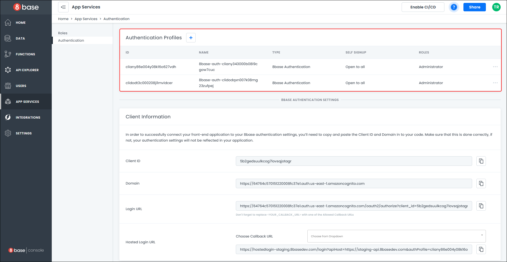
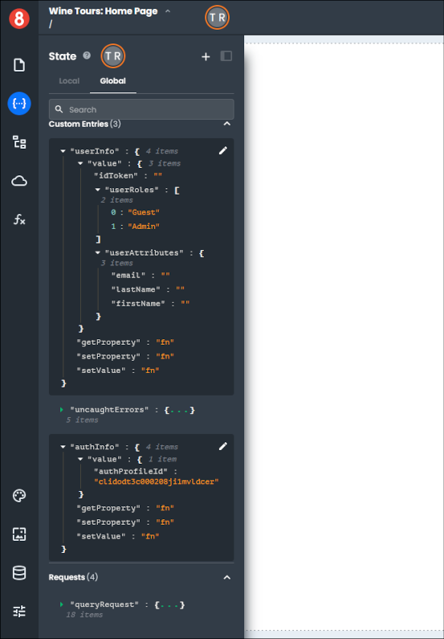
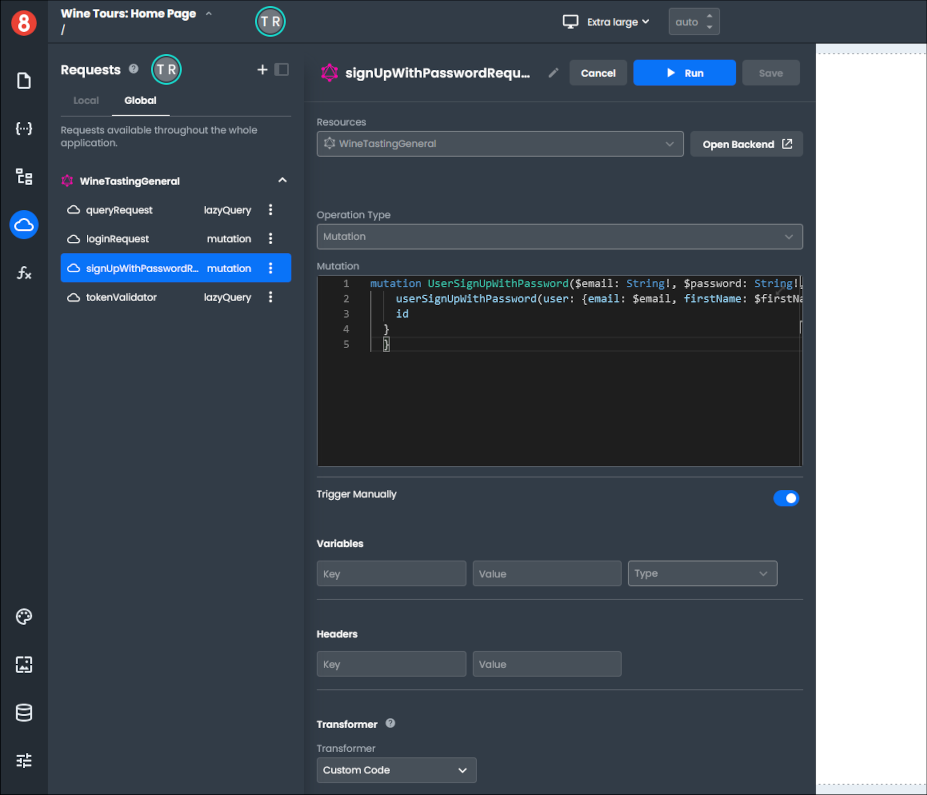
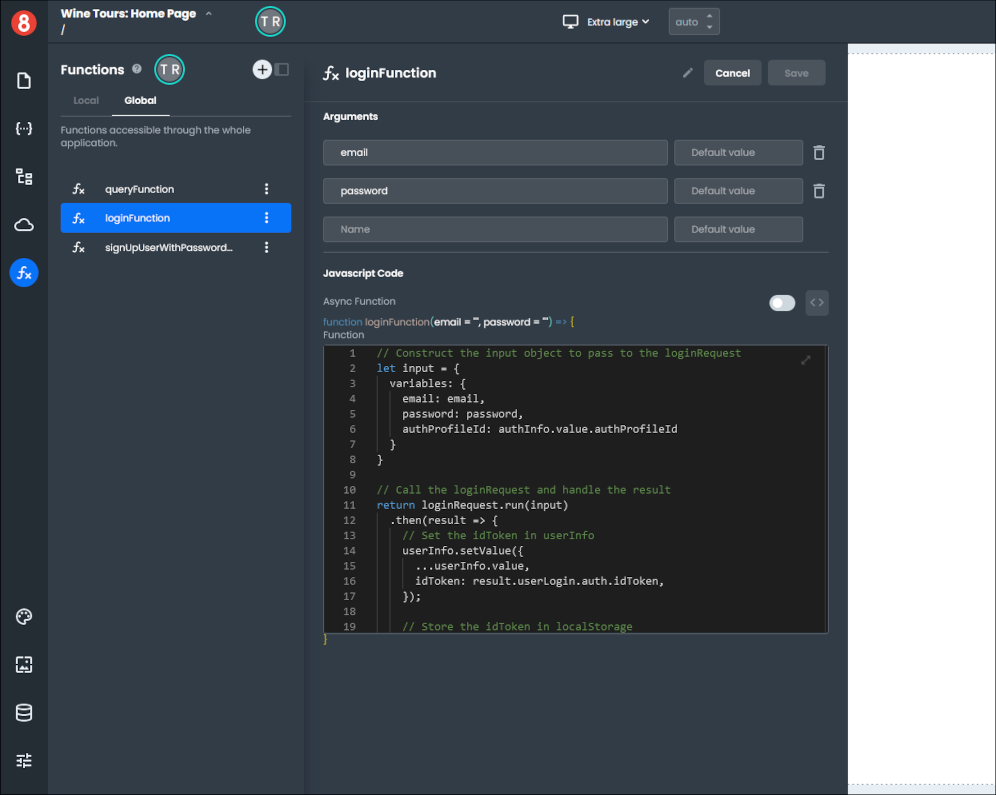
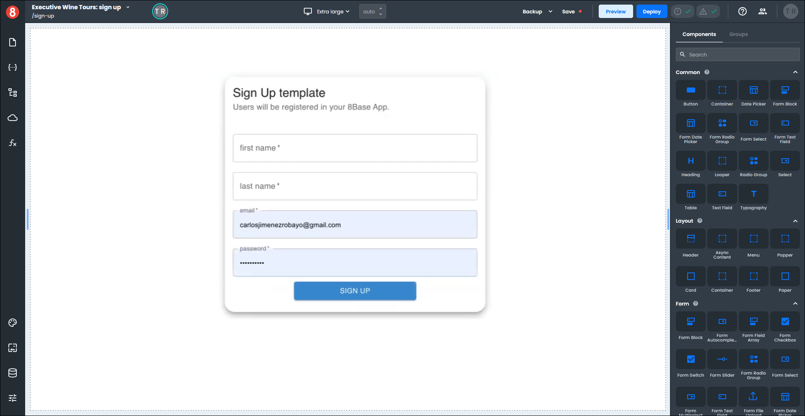
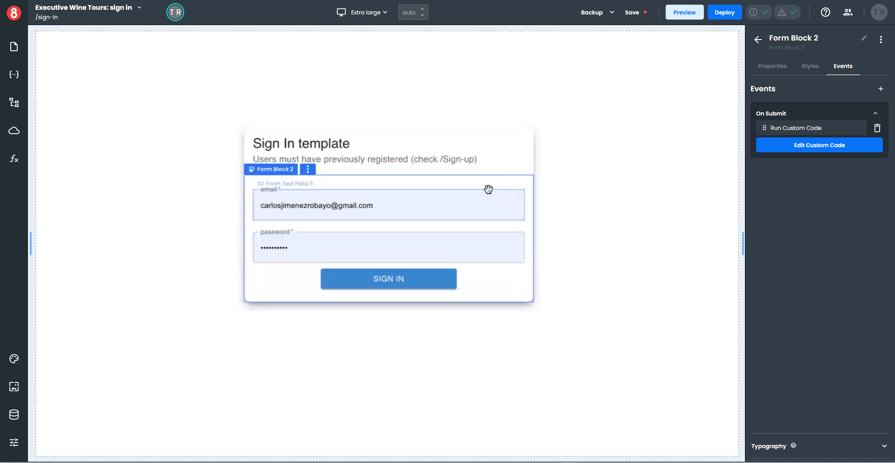
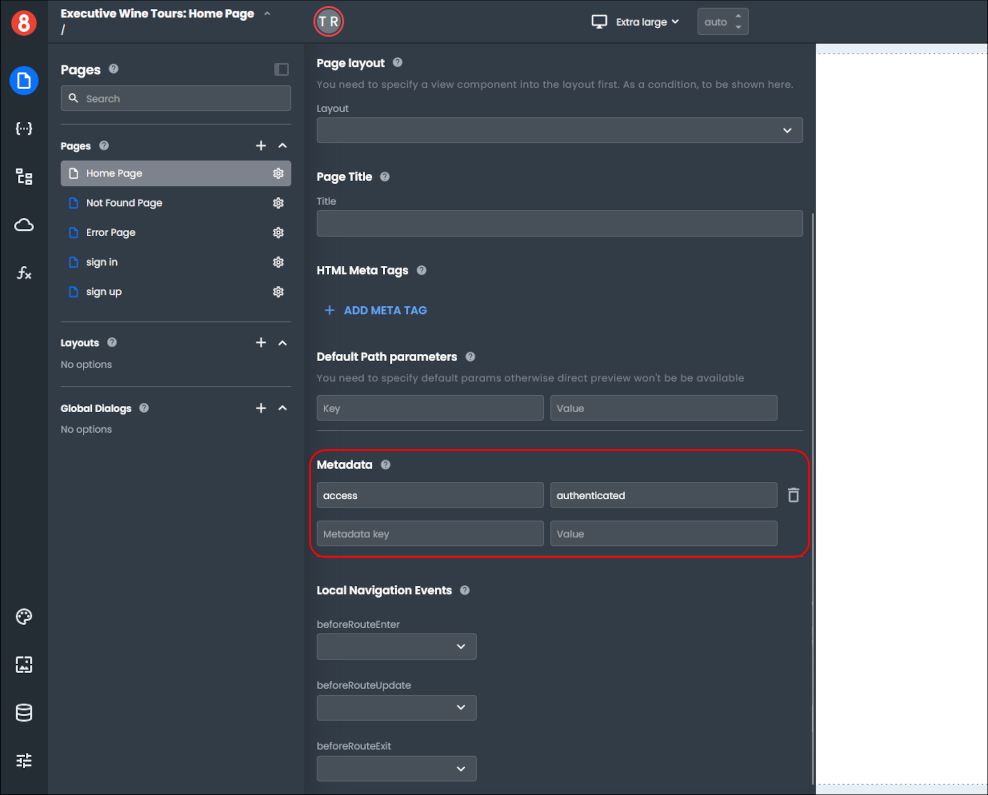
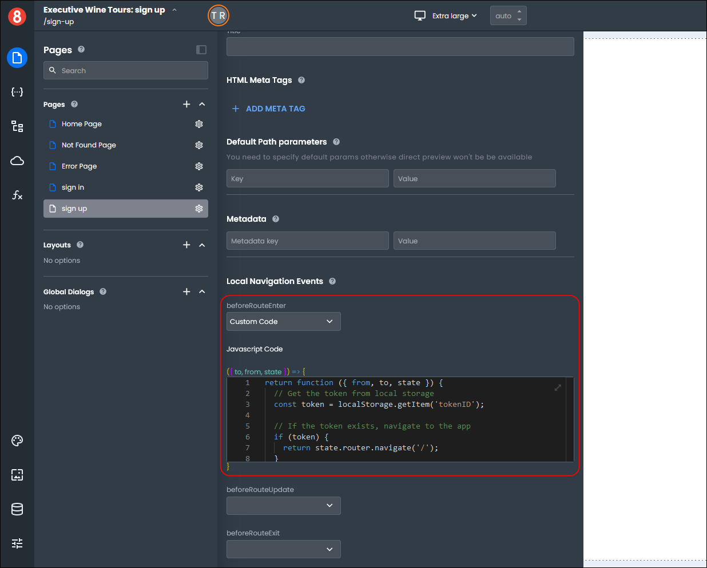
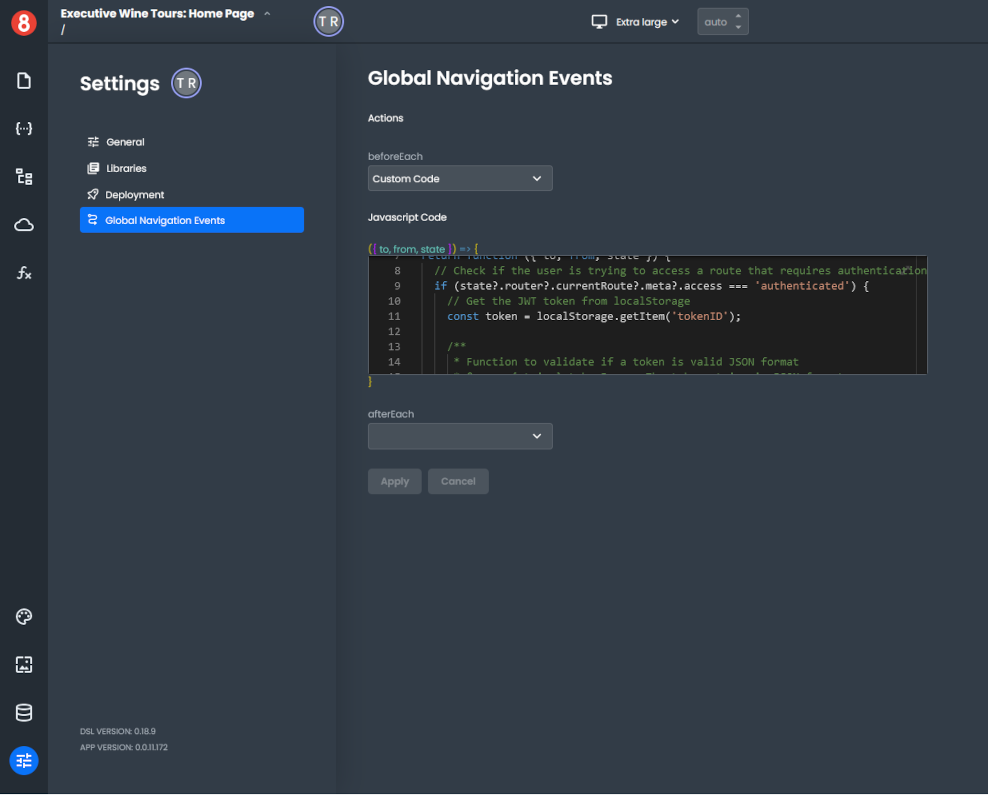

# Coded Login Authentication

8base offers you two types of *Integrated Authentication* for your projects: **Hosted Login** and **Coded Login**. 

The **Coded Login** integrated authentication provides a default authentication profile, Sign In and Sign Up pages, and the GraphQL mutations and functions required to make these pages functional right out of the box.
_______

## Coded Login

There are two cases for using the *Coded Login* integrated authentication. When you create a new **Project**and a new **Frontened** for an existing full stack project.

**New Project**
If you selected *Coded Login* as your integrated authentication during a new **Project** creation, a default authentication profile was automatically created for you.

**New Frontend**
If you selected *Coded Login* as your integrated authentication during a new **Frontend** creation, your project would use either an existing or new authentication profile.

### Authentication Profile

To view the authentication profile used by your project, open your project's **Backend** portion. Once your Backend loads, select *App Services > Authentication* to view the Authentication profile(s).

To see the authentication profile in your frontened, open your project's **Frontend** portion, click the "State" icon, and select the "Global" tab.

In the Custom Entries section, you will see entries for the **userInfo** and **authInfo**. 

The **userInfo** has an *idToken*, *userRoles*, and *userAttributes*, that are initially empty or filled with default values. These values will be populated when the user logs in.

The **authInfo** has an *authProfileId* that is the same as the authentication profile id you saw in the Authentication Profiles in your project's **Backend**.

### GraphQL Mutations and Functions

8base provides the necessary GraphQL mutations for handling the **Sign In** and **Sign Up** functionalities for the *Coded Login*. These are in the **Global Requests** section of your project's **Frontend**.

Functions that call these GraphQL mutations are also provided in the **Global Functions** section of your project's **Frontend**.

### Sign In and Sign Up pages

In addition to the GraphQL mutations and functions, you get basic pages for the **Sign In** and **Sign Up**.

You must add forms to each page and the necessary input fields to collect the data you need to Sign In and Sign Up. Next, you must add an **On Submit** event to each page's **Form Block** and write custom code to call a function to pass in your form data.

**Example: Setting up the On Submit event and function call**

For example, on the Sign In page, you need to attach an **On Submit** event to the **Form Block** that runs custom code to call the login function and pass the input fields to the function. 

The function will then call its corresponding mutation, which sends the data to your application's **Backend** portion.

To attach the **On Submit** event, select the **Form Block** on your Sign In page, click the "+" sign on the *Events* tab, and choose On Submit in the drop-down.

Click the "Choose Action" button and select **Run Custom Code**, then click the "Add Custom Code button" to open the **code editor**.

Inside the code editor add the call to your login function by typing in `loginFunction(data.signInEmail, data.signInPassword);` and click "Done" to save your code.

Both the login and sign up functions were created when you set up your project or frontend authentication, so you just need to call the appropriate function for your page.

### Authenticating Users

Within the application, you check each page the user tries to access to see if it requires authentication.

You can see if a page requires authentication by selecting the page in your **Frontend** and opening the **Page Settings**. In the *Metadata* section, if you see a **key/value** pair **access/authenticated**, the page requires authentication.

No authentication is required on the **Sign Up** page, but the `beforeRouteEnter` calls custom code to check if the user is already logged in and redirects the user to the Home Page if they are logged in.

The **Home Page** has a **Global Navigation Event** that checks if the page has an **access/authenticated** key/value pair, and if so, checks the **local storage** for a valid *tokenID* and performs some validation.

When you add a new page to your project, you must add the **access/authenticated** key/value pair to the *Metadata* section if you want to restrict access to it.

The **Global Navigation Event** to validate the user is authenticated will automatically be added to your page when you add the **access/authenticated** key/value pair.

**Note:** For an in depth discussion of how authentication works see the article on [Authentication](/projects/backend/8base-console-authentication.md).