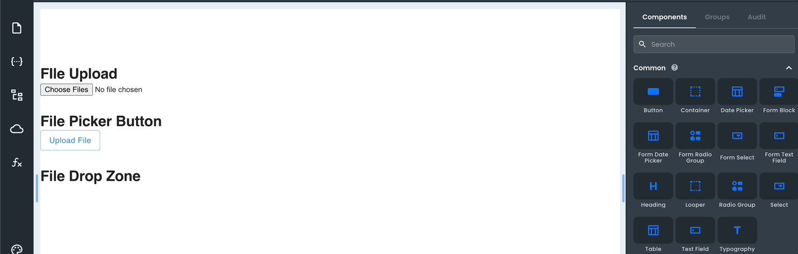
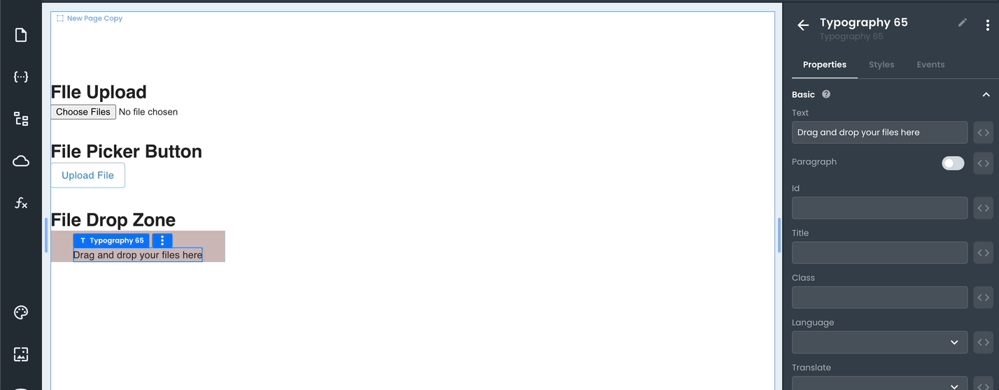

# File Drop Zone

The _File Drop Zone_ component is a variant of the [_File Upload_](/projects/frontend/app-components/control-components/file-upload) component; just like the original version, it allows users to browse and select one or more files to upload. It is used independently or as a form component within a Form Block. Additionally, this component allows the user to drag & drop files into it.

This component differs by being a container-type component rather than a file-type input. However, even though its presentation is different, under the hood, all its properties and functionality are the same as the [_File Upload_](/projects/frontend/app-components/control-components/file-upload) component.

The _File Drop Zone_ component is a container that has typography and icon components inside to give the user greater flexibility when customizing.

For example, the user can change the text "Drag & drop file here" or even the file upload icon.

The component also has **Custom Properties** that allow you to add additional properties using **Key** **Value** pairs.

### Properties

<table>
<thead>
<tr><th>Name</th><th>Type</th><th>Default</th><th>Description</th></tr>
</thead>
<tbody>
<tr><td>acceptedFiles</td><td>string</td><td></td><td>Defines a comma-separated list of allowed file types.</td></tr>
<tr><td>wrongFileTypeText</td><td>string</td><td>"Wrong file type uploaded"</td><td>Defines the text in the error message to be shown when uploading a file with a different type than the one set.</td></tr>
<tr><td>maxFileSize</td><td>number</td><td></td><td>Defines the maximum size of a file.</td></tr>
<tr><td>fileSizeExceededText</td><td>string</td><td>"Max file size exceeded (maxFileSize)"</td><td>Defines the text in the error message to be shown when uploading a file with a size larger than the one set.</td></tr>
</tbody>
</table>

Additionally, As a [_Container_](/projects/frontend/app-components/layout-components/container) component, it also exposes the same style properties.

