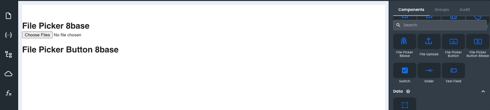

# File Picker Button 8base

The _File Picker Button 8base_ component is a variant of the [_File Picker 8base_](/projects/frontend/app-components/control-components/file-picker-8base) component; just like the original version, it allows a user to select a file to upload to an 8base workspace. 

This component differs by being a button component rather than a file-type input. However, even though its presentation is different, under the hood, all its properties and functionality are the same as the [_File Picker 8base_](/projects/frontend/app-components/control-components/file-picker-8base) component.

If the **uploadOnChange** property is enabled, the **filename** and **fileId** are passed to the application backend. 

The **filename** is the file's actual name, and the **fileId** is a reference to the file's location on the backend. This information is helpful if, for example, you want to display the file as an avatar on your application.

### Properties

<table>
<thead>
<tr><th>Name</th><th>Type</th><th>Default</th><th>Description</th></tr>
</thead>
<tbody>
<tr><td>8baseBackendWorkspace</td><td>string</td><td></td><td>Specifes the name of an 8base workspace.</td></tr>
<tr><td>authorizationHeader</td><td>string</td><td></td><td>Specifies an 8base API token or an ID token (JWT token).</td></tr>
<tr><td>disabled</td><td>bool</td><td>false</td><td>If true, the file picker 8base is disabled.</td></tr>
<tr><td>acceptedFiles</td><td>string</td><td></td><td>Defines a comma-separated list of allowed file types.</td></tr>
<tr><td>maxFileSize</td><td>number</td><td></td><td>Defines the maximum size of a file.</td></tr>
<tr><td>uploadOnChange</td><td>bool</td><td>false</td><td>If true, the onChange event is used to upload files.</td></tr>
</tbody>
</table>

Additionally, As a [_Button_](/projects/frontend/app-components/control-components/button) component, the _File Picker Button 8base_ component also exposes the same style properties (except those in the advanced section).
