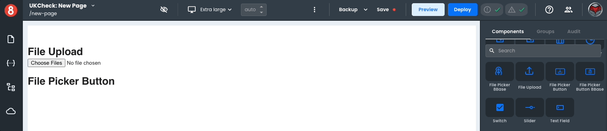

# File Picker Button

The _File Picker Button_ component is a variant of the [_File Upload_](/projects/frontend/app-components/control-components/file-upload) component; just like the original version, it allows users to browse and select one or more files to upload. It is used independently or as a form component within a Form Block.

This component differs by being a button component rather than a file-type input. However, even though its presentation is different, under the hood, all its properties and functionality are the same as the [_File Upload_](/projects/frontend/app-components/control-components/file-upload) component.

The component also has **Custom Properties** that allow you to add additional properties using **Key** **Value** pairs.

### Properties

<table>
<thead>
<tr><th>Name</th><th>Type</th><th>Default</th><th>Description</th></tr>
</thead>
<tbody>
<tr><td>acceptedFiles</td><td>string</td><td></td><td>Defines a comma-separated list of allowed file types.</td></tr>
<tr><td>maxFileSize</td><td>number</td><td></td><td>Defines the maximum size of a file.</td></tr>
</tbody>
</table>

Additionally, As a [_Button_](/projects/frontend/app-components/control-components/button) component, it also exposes the same style properties (except those in the advanced section).

