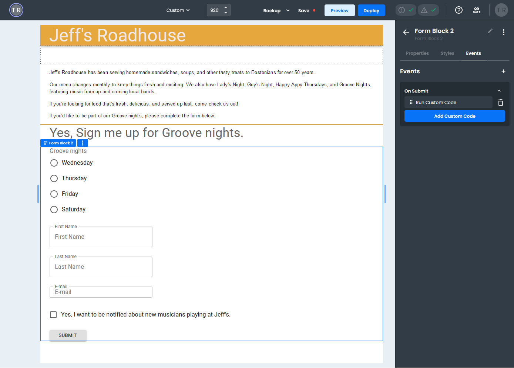
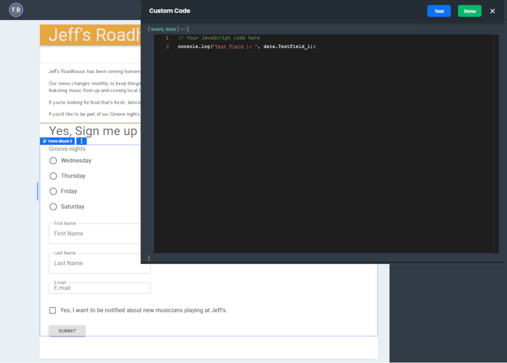

# Form Components Overview
The Frontend application provides a set of components grouped into two sections on the *Component* pane for convenience, **Form** and **Controls**. Most of the components in these sections have similar names, and their functionality is the same, with a few minor differences.

*Form* components **have** a Name property and **must** be placed within a *Form Block*.

## Form Components
For more information about a specific *Form* component, see the **Controls Components** section on the *8base documentation site*.

- Form Block
- Form Autocomplete
- Form Checkbox
- Form Date Picker
- Form Field Array
- Form File Upload
- Form Multiselect
- Form Radio Group
- Form Text Field
- Form Time Picker
- Form Select
- Form Slider
- Form Switch

## Controls Components
*Controls* components **do not have** a Name property and **must** be placed within a *Page*.
You can place **only** these specific *Controls* components within a *Form Block* or a *Page*.

- Button
- Radio
- Toggle Button
- Toggle Button Group

:::note
 All other components except for the *Controls* components can be placed within a Form.
::: 

## Form submission
Every *Form Block* must contain an **On Submit** event that allows you to submit the data collected by your form. You also need a **Button** of type *Submit*, and you must write custom code to process and handle the form submission.

**What can you do with data from a Form submission:**
- Write the data to the console.
- Send the data to a database.
- Change the current interface display.
- Send the data to another part of your application.
- Perform calculations on your data for use elsewhere.

### On Submit event
You can access the **On Submit** event on the *Events* tab on the right-hand pane of the project builder. After adding an On Submit event, set the "Choose Action" to **Run Custom Code**.

To add custom code to process your form data, click the "Add Custom Code" button, which opens the **Code Editor**.

### Custom code
Inside the **Code Editor**, you can write any **JavaScript** code you need to handle your form submission.

Every *Form* has a hidden variable called `data`. You can access your form's data by referencing this variable, and you reference the component's name to access data in a specific component.

Let's say you have a *Form* component called *TextField_1*. To access this component's data, you would reference it as `data.TextField_1`.

To access all of the form's data, especially during testing, you can log it to the console using `console.log("Data " + data)`, which will allow you to confirm all your form's components are working correctly.

