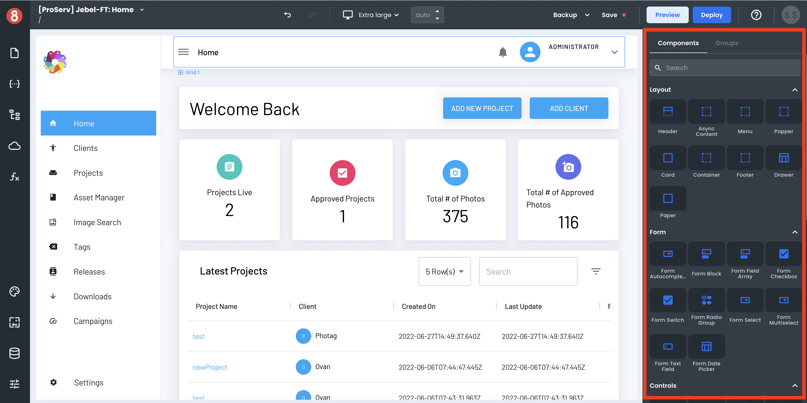

# App Components Introduction

This document describes what Components are in App Builder and why they're useful when building applications.

---

Components are the drag-and-drop building blocks of an App Builder application. Each component represents a piece of functionality or UI element that can be added to an application, such as a form, a list, or an input.

Components are flexible and can be styled and configured to fit the needs of each individual application. For example, a form component can be configured to include different fields, such as text input, radio buttons, or a date picker, and then have custom styles applied to modify its look and feel.

Components can be grouped together for reuse throughout an application, which makes them very efficient to work with. This means that once a Component Group has been created, it can be used in any number of applications without having to recreate it each time.

App Builder ships with many pre-built components based on Material UI and can be used in applications. All components expose **properties**, **styles**, and **events**, allowing you to modify their look and behavior.

## Next Steps

Components are an important part of App Builder and are essential for creating efficient and scalable applications. In the following sections, we'll explore how to use them in your App Builder apps.
